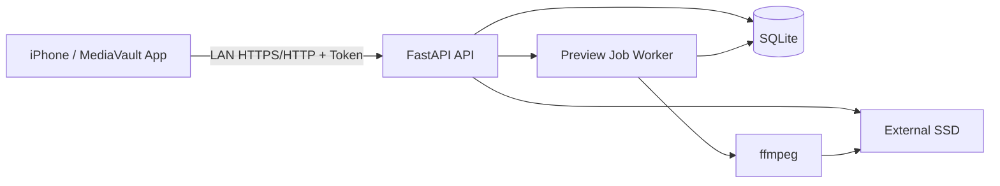

# MediaVault アーキテクチャ設計書

## 前提と方針

- Mobile AppはReact Native + Expo managed workflow + JavaScriptで実装する。
- BackendはFastAPI、DBはSQLite、preview生成はffmpegを使う。
- Mac mini移行時はDocker内の実行環境を正とする。
- 外部SSDの保存先ルートは`MEDIA_ROOT`で指定する。
- originalはimmutableとして扱い、derived fileと分離する。
- Phase 1は`104857600 bytes`以下の通常uploadによるUX検証、Phase 2は大容量安全転送とする。

## コンテキスト図



## テクノロジースタック

| 分類 | 技術 | 方針 |
|------|------|------|
| Mobile runtime | Node.js 24, Expo SDK 54 | `.nvmrc`とdevcontainerをNode 24で統一 |
| Mobile UI | React Native, JavaScript | TypeScriptは明示依頼なしに導入しない |
| Device API | `expo-media-library` | Expo関連依存は`npx expo install`で追加 |
| Backend | Python, FastAPI | LAN内APIとjob登録を担当 |
| Backend dependency manager | uv | `pyproject.toml`と`uv.lock`で依存を固定 |
| DB | SQLite | 個人利用MVPに十分。migration方針は実装時に確定 |
| Preview | ffmpeg | originalを読み取り入力としてderived fileを生成 |
| Deployment | Docker on Mac mini | ホストNodeへ依存しない |
| Storage | External SSD | `MEDIA_ROOT`配下に保存 |

## コンポーネント責務

### Mobile App

- 写真・動画選択、nullable metadata取得、LOG指定。
- Backend URLと固定APIトークンの設定。
- upload進捗、asset状態、preview表示、確認操作。
- original削除は実行しない。

### FastAPI API

- Token認証。
- upload size/type検証。
- 安全なファイル名と保存パスの生成。
- original保存、SHA256計算、SQLite記録。
- preview job登録、asset/job参照、preview配信、確認済み更新。

### Job Service

- job状態を`queued`, `running`, `done`, `failed`で管理する。
- Phase 1はpreviewとlut_previewを処理する。
- Phase 3+でAI解析jobを追加可能にする。

### Preview Adapter

- originalを改変しない。
- H.264 MP4、AAC音声、1080p上限でpreviewを生成する。
- LOG素材には設定済みRec.709 LUTを適用する。
- 写真はJPEG、長辺2048px上限、縦横比維持、EXIF orientation反映でpreviewを生成する。
- Phase 1でHEIC、JPEG、PNG入力の検証fixtureを用意し、Docker内ffmpeg buildのcodec対応を確認する。
- stdout/stderrを安全に扱い、機密値をログへ含めない。

## データ管理

### SQLite

- DBファイル配置はbackend設定で指定する。
- assets、derived_files、jobsをPhase 1で作成する。
- upload_sessions、upload_chunksはPhase 2で追加する。
- statusは一つの列へ集約せず、役割ごとに分離する。

### External SSD

```text
${MEDIA_ROOT}/
├── originals/
├── previews/
├── thumbnails/
├── jobs/
└── tmp/
```

- `originals/`: immutable original。
- `previews/`, `thumbnails/`: derived file。
- `tmp/`: upload中、一時生成中のファイル。
- `jobs/`: 必要なjob関連ファイル。DB jobレコードと役割を混同しない。

## ファイル保存フロー

1. uploadは`tmp/`へ保存する。
2. size/typeを検証する。
3. backend側生成パスで`originals/`へ確定保存する。
4. Mac mini側でSHA256を計算する。
5. assetsを記録し、preview jobを登録する。
6. ffmpegはoriginalを読み取り、previewを別パスに生成する。
7. derived_filesを記録する。

## セキュリティ

- Phase 1でも固定APIトークンを必須にする。
- Tokenは環境変数でbackendへ渡し、ログに出さない。
- API要求は`Authorization: Bearer <token>`形式とする。
- Mobile側のTokenは`expo-secure-store`へ保存する。平文ハードコードは禁止する。
- クライアント由来のファイルパスを使用しない。
- Path traversalを防ぐため、保存先パスはbackend側で構成する。
- LAN内運用でも認証を省略しない。

## 信頼性

- 外部SSD未接続時はupload開始前または保存時に明示的に失敗する。
- 容量不足、I/O失敗、ffmpeg失敗をjob/asset状態に反映する。
- Phase 1 SHA256はサーバー側計算・記録であり、end-to-end検証とは表示しない。
- Phase 2ではchunk hashと結合後hashを照合する。
- Phase 2ではiPhone側`expected_file_sha256`とMac mini側`server_sha256`が一致した場合のみ`file_verified`とする。

## Docker方針

- Mac miniではDockerを正規実行環境とする。
- Node 24、Python、ffmpegのバージョンはDocker側で固定する。
- Backend Python依存は`uv.lock`を使ってDocker内で再現可能にinstallする。
- ローカル`node_modules`をDockerへコピーしない。
- 外部SSDはcontainerへvolume mountし、container内の`MEDIA_ROOT`へ割り当てる。
- host上の`/Volumes/MediaVault`などのパス差分はcompose環境変数で吸収する。

## Phase 1 Job方針

- jobはSQLiteへ永続化する。
- Phase 1はAPIと単一workerを使い、SQLiteはWAL modeと`busy_timeout = 5000ms`を設定する。
- DBファイルはDocker volumeで永続化する。
- workerはSQLite transactionで`queued` jobをatomic claimする。
- jobは`claimed_at`と`lease_expires_at`を持ち、期限切れ`running` jobを`queued`へ回収する。
- Dockerではworkerを独立serviceとして起動し、`restart: unless-stopped`を設定する。
- 理由: ffmpeg処理をAPI request lifecycleから分離し、将来のAI jobへ拡張しやすくするため。

## 品質確認

- Mobile: `npx expo install --check`, `npm run lint`, `npm test`, `npx expo start`
- Backend: `uv run pytest`を標準のtest commandとし、lintを導入した場合も`uv run ...`で実行する。
- 実機: Development Buildでライブラリアクセス、LAN通信、preview再生を確認する。

## Open Questions

- Docker Composeの具体構成とMac miniのSSD mount path。
- Rec.709 LUTファイルとpreview bitrate。
- HTTP/HTTPSと将来のLAN discovery。
