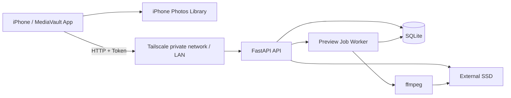

# MediaVault アーキテクチャ設計書

## 前提と方針

- Mobile AppはReact Native + Expo managed workflow + JavaScriptで実装する。
- BackendはFastAPI、DBはSQLite、preview生成はffmpegを使う。
- Mac mini移行時はDocker内の実行環境を正とする。
- 初期リリースは1つのBackend URLと1つの固定APIトークンだけを持つ。URLはMobile設定値であり、
  ソースコードへ固定しない。shared endpoint policyを保存時と全通信境界のauthorityとし、
  accepted private HTTP又は有効なHTTPS originだけへtokenを送る。
- 自宅Mac miniのbackendを公開インターネットへ直接公開しない。App Review用に公開運用する場合は、自宅環境・データと分離したHTTPS backendを使う。
- 外部SSDの保存先ルートは`MEDIA_ROOT`で指定する。
- originalはimmutableとして扱い、derived fileと分離する。
- Phase 1は`104857600 bytes`以下の通常uploadによるUX検証とする。Phase 2は2Aの大容量安全転送とmanaged rendition基盤、2BのApple Log preview、2Cの安全削除候補の順に進める。

## コンテキスト図


```mermaid
graph LR
    iPhone[iPhone / MediaVault App]
    Photos[iPhone Photos Library]
    Tailnet[Tailscale private network / LAN]
    API[FastAPI API]
    Worker[Preview Job Worker]
    DB[(SQLite)]
    SSD[External SSD]
    FFmpeg[ffmpeg]

    iPhone --> Photos
    iPhone -->|HTTP + Token| Tailnet
    Tailnet --> API
    API --> DB
    API --> SSD
    API --> Worker
    Worker --> FFmpeg
    FFmpeg --> SSD
    Worker --> DB
```

## テクノロジースタック

| 分類 | 技術 | 方針 |
|------|------|------|
| Mobile runtime | Node.js 24, Expo SDK 54 | `.nvmrc`とdevcontainerをNode 24で統一 |
| Mobile UI | React Native, JavaScript | TypeScriptは明示依頼なしに導入しない |
| Device API | `expo-media-library` | Expo関連依存は`npx expo install`で追加 |
| Backend | Python, FastAPI | private endpoint APIとjob登録を担当 |
| Private network | Tailscale, LAN | Phase 1のiPhone-backend到達経路 |
| Backend dependency manager | uv | `pyproject.toml`と`uv.lock`で依存を固定 |
| DB | SQLite | 通常startup migrationとoffline one-shot 008/009/010をschema identityで分離 |
| Preview | ffmpeg | originalを読み取り入力としてderived fileを生成 |
| Deployment | Docker on Mac mini | ホストNodeへ依存しない |
| Storage | External SSD | `MEDIA_ROOT`配下に保存 |

## コンポーネント責務

### Mobile App

- 写真・動画選択、nullable metadata取得、LOG指定。
- 1つのBackend URLと固定APIトークンを設定する。URLは通常設定保存、
  tokenは既存の`expo-secure-store` keyへ保存する。server name/ID、複数profile、QR importは将来機能とする。
- RFC1918、Tailscale IPv4、single-label MagicDNS、`.local`のHTTP又は有効なHTTPS originを設定する。
- upload進捗、asset状態、要求・適用presetと色変換状態を含むpreview表示、確認操作。
- Asset Detailでactive processed resultを明示downloadし、temporary fileのresponse identity、size、native streaming SHA-256を検証してから`expo-media-library`へ保存する。
- eligibleな通常videoではversioned catalogのpresetだけを選択し、client request IDをPOST前にasset単位で永続化してrendition phaseをpollする。新しいselection後の古いPOST/poll結果はcurrent UIを上書きしない。
- formal preview responseはstatus/profile/requested preset/transform tupleをclosed sanitizerで検証する。Apple Log 1/2はshared presentation helperでexact `(unconverted)` labelを表示し、invalid claimではasset authorityを破棄してpreview、confirmation、result save、local deletionへ進まない。
- 処理済みcopyの保存状態は`processedResultSaveStore`で管理し、source originalの`localAssetMappingStore`やBackend review/delete stateを変更しない。
- 自動削除は実行しない。
- preview確認後にユーザーが明示操作した場合のみ、iPhone写真ライブラリ上のoriginal削除を端末service経由で実行する。
- Backend側original、derived file、asset DB recordはMobileの削除操作では削除しない。

### FastAPI API

- Token認証。
- upload size/type検証。
- 安全なファイル名と保存パスの生成。
- original保存、SHA256計算、SQLite記録。
- preview job登録、asset/job参照、preview配信、処理済みresult配信、確認済み更新。
- `/api/v1`でcapability、safe preset catalog、冪等なrendition作成・参照を提供する。routeはfilesystem path、raw manifest/LUT、token、FFmpeg stderrを返さない。

### Job Service

- job状態を`queued`, `running`, `done`, `failed`で管理する。
- Phase 1はpreviewと安全ゲート中のlut_previewを処理する。Phase 2Aはsessionごとに一意な`upload_finalize` jobをlease/reclaim可能にし、managed requestごとの`rendition` jobを専用processorへ明示dispatchする。Phase 2B detector-v2ではoriginal確定後にsame-fd parser/FFprobe判定を行い、Apple Log 1/2のprofile別formal preview provenanceを保存する。0.4.0では両予約presetをabsent/disabledに限定し、`compress-only` previewだけを`done`にする。session由来video preview jobはassetと同じ`preview_generation`を持ち、claim/commit時に一致しない場合はattemptを`superseded`、jobを`failed` + `preview_generation_superseded`へlease clear付きで収束させ、assetを書き換えない。
- Phase 3+でAI解析jobを追加可能にする。

### Preview Adapter

- originalを改変しない。
- H.264 MP4、AAC音声、1080p上限でpreviewを生成する。
- Preview Adapterは色変換を行わず、Apple Log 1/2とも`lut_path = None`のH.264/AAC `compress-only` commandを構築する。Apple Log 1は`generated-apple-log-rec709`、Apple Log 2は`generated-apple-log2-rec709`をrequested presetとしてのみ記録する。
- detector-v2 ruleはrepository ownerがApple公式identifier source URL、確認日時、承認role付きcanonical inputとして人手承認する。認証scriptはruleを生成せず、repo外のユーザー所有Apple Log 2/ordinary動画とproject-owned synthetic Apple Log 1 containerをowner-only snapshotとして検証し、path-free artifactだけを生成する。
- identity/test/customの選択はmanaged renditionに閉じ、reserved automatic preset IDsはselectable catalogへ出さず、formal previewへ昇格しない。
- 写真はJPEG、長辺2048px上限、縦横比維持、EXIF orientation反映でpreviewを生成する。
- repository-owned HEIC/JPEG/PNG fixtureとstrict manifestを
  `image-codec-validation` Compose profileでproduction imageへmountし、
  read-only/offline runtimeでproduction image-preview adapterの実decodeを検証する。
- stdout/stderrを安全に扱い、機密値をログへ含めない。

### Managed Preset Rendition

- registryはvirtualな`compress-only`、repository内のgenerated identity/test manifest、optionalなrepo外`USER_LUT_ROOT`を統合し、`absent`、`disabled`、`registered_invalid`、`valid`へ分類する。catalogには`compress-only`とenabledかつvalidなsafe metadataだけを出す。
- manifestはstrict schema v1とRFC 8785 JCS digest、LUTはbounded `.cube` parser、grid、row count、finite value、SHA-256で検証する。valid requestはcanonical manifest bytesとLUT identityをrenditionへimmutable snapshotする。
- workerはserver-owned rootをsource kindから選び、各path componentをno-follow descriptorで開く。validated descriptorからowner-onlyのjob-private LUTへcopyし、FFmpeg直前にsize/hashを再検証するため、directory entry差替え後のpathを再解決しない。
- `assets.rendition_selection_generation`がselection順序の正本である。current generationのfinalizerだけがderived fileとready result、provenance、rendition `ready`、active pointer、job `done`の順で一transactionに確定する。pointer切替ではmigration/delivery用steady-state classifierとは別のtransition validatorを使い、OLDが完全なformal又はmanaged relation、NEWがcurrent selectionの一意なready managed relationの場合だけ許可する。kind-aware triggerは直前のcurrent managed resultだけをsupersedeし、current formal resultを維持する。失敗時は直前の成功済みactive resultを維持する。stale generationは同じ監査証跡を持つsuperseded resultにするがpointerとpreview/review stateを変更しない。
- managed resultの`preview_generation`はPhase 2A、Phase 2Bともnull、`formal_preview_id`は未設定とし、`rendition_selection_generation`をordering authorityにする。Phase 2BだけがApple Log検出とnon-null formal preview generation、preview/review state移行を所有する。

### Detector-v2 same-fd boundary

- `detector_source`がverified originalを`O_RDONLY`と利用可能な`O_NOFOLLOW`で1回だけ開き、regular file、stored size、descriptor/path identityを検証する。parserとFFprobeは`/proc/self/fd/<n>`または`/dev/fd/<n>`を共有し、判定中にsource pathを再openしない。
- project-owned bounded parserはtop-level `ftyp`と単一`moov`から、video `trak`の`stsd` visual sample entry直下にある`logs`だけをparseする。`mdat`、`hoov`、unknown payloadはseekし、全ファイルbyte searchを行わない。
- FFprobe `stream.id`をtrack IDへexact対応し、parser identifierとallowlist済みcolor fieldsをclosed tableで統合する。`apple-log-1`、`apple-log-2`以外をApple Log profileへ昇格しない。
- detector artifactsはrule schema v2、parser contract version、resource limits、exact identifier/profile/preset mapping、FFprobe version、external fixture SHA-256を固定する。runtime artifact identity又はsuccessor schema identityが不正ならcapabilityをfail closedにする。

## データ管理

### Operator migration safety boundary

- 002–007はFastAPI lifespan、worker、startup recovery/backfillから分離したoffline CLIだけが、固定marker列とSQL digestを検証して適用する。exact 001又はexact 007以外はfail closedとし、002–006部分commit後の自動再開を禁止する。
- 002–009 orchestrationはmanifest nonceとDocker labelが一致するdisposable DB volumeだけを受理し、current HEAD/commitとhost contractのclean tracked state、DB volume consumer inventoryをauthorityとする。検証済みone-shotでvolume markerを作り、全entrypointがvolume/nonceを再確認する。API常時停止、008後のpinned worker-only drain、worker再停止、009 dry-run/apply、010 read-only preflightの順を固定する。各containerは作成後・起動前にactual project/image/Entrypoint/Cmd、pinned image `Config.Env`とphase envのexact merge、mount/securityを検証し、running containerはID/imageまで一致させる。one-time claim、ambient Compose override/build/pull/未知container拒否により自動再開を行わない。
- container contractはenv allowlist、persistent mount exact set、privileged/device/host namespace/restart policy/tmpfs denyを含み、create/inspect後とstart直前のconsumer再列挙でTOCTOUを閉じる。旧auto-restart host wrapper/Compose migratorは無効化し、旧CLIにもcontainer DB pathのmarker guardを置く。
- 010 preflightはwritable共通接続とoperator apply wrapperから分離し、SQLite URI read-only connectionとCompose `:ro` mountを二重境界にする。main DBとWAL/SHMを作成・変更しない。
- rollback authorityはowner-only fresh SQLite Backup API artifact、別々に固定したrelease/rollback image/env、hostでは`/private/tmp/mediavault-operator-*`、containerでは`/restore`に限定したnonce付きdisposable restore rootである。`MEDIA_ROOT`も同rootのstrict childとする。rollback image/envはAPI/worker停止containerのactual command/mount/securityまでdry inspectする。DB参照derivedとの突合後、operation由来orphanだけをcleanupし、originalとpre-existing derivedを不変に保つ。
- Restore mutation前にfailure DB/main/WAL/SHMのraw identity、取得可能なlogical identity、fresh backup/attestation identityをowner-only forensic artifactへ固定する。commit後faultは008/009/010 serviceがrestore-requiredへ分類し、orchestratorは停止確認後にpinned DB `:ro` identity one-shotでactual marker prefix/integrity/FKを読み、phase履歴から推測しないlast committed versionを返す。

### SQLite

- DBファイル配置はbackend設定で指定する。
- assets、derived_files、jobsをPhase 1で作成する。
- upload_sessions、upload_chunksはPhase 2で追加する。sessionはclient idempotency key、immutable metadata、expected hash、failure/retry、expiry、lease、asset/job参照を持ち、chunkは`UNIQUE(session_id, chunk_index)`とverified hashを持つ。
- processed_resultsはPhase 2Aのdeliverable video identityである。assetsのdeferred active pointerはsame-assetの`ready` resultだけを指し、result/derived file/size/SHA-256/pointer/job完了は一つのtransactionで確定する。
- renditionsはglobal uniqueなclient request ID、job、asset、selection generation、immutable preset snapshot、phase、nullable resultを持つ。rendition_provenanceはrendition/result/derived fileと一対一で、要求・適用presetとmanifest/LUT digest、transform outcomeを不変に保持する。
- Phase 2Bではcertified detector manifest、generation単位の`formal_preview_attempts`、完成したderived/resultと一対一のpreview provenanceを追加する。attempt/provenance/assetのstatus/profile/requested preset relationをclosed schema/triggerで保護し、Apple Log 1/2はprofile別`compress-only` unavailable tupleだけを0.4.0 authorityにする。rendition provenanceとは相互変換しない。
- Phase 2Cでは`safe_to_delete_candidate`をstored projectionとして扱い、session/chunk/whole-file identityとcurrent formal relationを共通evaluatorで再導出する。candidate単独を削除権限にせず、Mobile local mappingと明示確認を別authorityとして維持する。
- `009_safe_delete_candidate`はstartup migrationに含めない。offline one-shot migratorがPhase 2B identity、runtime、drain、upload hard boundsをread/locked preflightし、assets table rebuild、metadata、backfill、foreign key/candidate integrityを一transactionで確定する。
- `010_apple_log_container_signaling`もstartup migrationに含めない。successor migratorは008/009 object identityとrow compatibility、parser/rule/manifest/summary、0.4.0 release readiness、両reserved preset namespace identityをread/locked preflightし、schema rebuild、marker、最終identityを一transactionで確定する。実装・検証中のdry-run/apply/rollbackはisolated DBだけで行う。operator DBでは専用read-only接続によるpreflightだけを事前に行い、全writer停止・drain、backup/restore drill、明示承認を満たす別release operationでのみapplyする。
- completed session/chunk、file-verified original identity、current formal derived identityはSQLite triggerで不変にし、preview generation、formal pointer、review、detection authorityを変える正規更新はcandidateを同一statement又は同一transactionで降格する。
- statusは一つの列へ集約せず、役割ごとに分離する。

### Mobile Local State

- backend asset idとiPhone写真ライブラリのlocal asset identifierを紐づける。
- iPhone側original手動削除の状態はMobile側で管理し、Backend側originalの状態と混同しない。
- local asset identifierは端末内の素材削除にのみ使い、backendへ保存先pathとして送らない。
- upload timeout後の`result_unknown`はtoken、URI、filenameを含めず端末に保存する。local asset idがない場合はglobal pending markerを使い、asset一覧確認済みの明示操作までuploadを再開しない。
- source originalのmappingとは別に、処理済みcopyの保存を`backend_asset_id`、`backend_result_id`、result SHA-256で識別する。写真ライブラリnative call直前に`unknown` markerを永続化し、成功時だけsaved local asset identifierを記録する。
- managed rendition requestはさらに別のasset-scoped AsyncStorage namespaceへclient request/rendition ID、selection sequence、safe rendition fieldsだけを保存する。token、URL、path、manifest/LUT本文は保存しない。
- 初期リリースのサーバー設定は1つのURLを通常設定へ保存し、
  1つのtokenを既存の`expo-secure-store` keyへ分離保存する。

### External SSD

```text
${MEDIA_ROOT}/
├── originals/
├── previews/
├── thumbnails/
├── jobs/
└── tmp/
```

- `originals/`: immutable original。
- `previews/`, `thumbnails/`: derived file。
- `tmp/`: upload中、一時生成中のファイル。
- `jobs/`: 必要なjob関連ファイル。DB jobレコードと役割を混同しない。
- `previews/renditions/`: immutable managed rendition MP4。生成中candidateは`tmp/renditions/`、job-private LUT snapshotは`jobs/{rendition_id}/`へ置き、terminal outcome後にcleanupする。
- custom LUTはDocker imageとGitリポジトリへ入れず、`USER_LUT_ROOT`として設定したMac mini側のrepo外ディレクトリをread-only mountして参照する。

## ファイル保存フロー

1. uploadは`tmp/`へ保存する。
2. size/typeを検証する。
3. backend側生成パスで`originals/`へ確定保存する。
4. Mac mini側でSHA256を計算する。
5. assetsを記録し、preview jobを登録する。
6. ffmpegはoriginalを読み取り、previewを別パスに生成する。
7. derived_filesを記録する。

## iPhone側original手動削除フロー

1. ユーザーがMac mini側previewを再生し、内容確認する。
2. Mobileは`POST /assets/{asset_id}/preview-confirmation`で`review_status = preview_confirmed`にする。
3. Mobileのpure predicateは`preview_ready`、`preview_confirmed`、local mapping available、
   未削除、非busyを共通条件として評価する。
4. `server_hash_recorded`のPhase 1 direct image/videoはformal capabilityを要求しない。
   `video + file_verified`のPhase 2 session videoだけ0.4.0 header付きdetail、compatible capabilityとready formal previewを追加要求する。
5. ユーザーが対象情報を確認し、削除を明示実行する。
6. Mobileは`expo-media-library` service経由でiPhone写真ライブラリ上のlocal original削除を要求する。
7. native削除成功は不可逆なterminal状態として直ちにMobile memoryへ反映し、その後のlocal state永続化失敗で削除actionを再表示しない。Backend側originalは保持する。

## セキュリティ

- Phase 1でも固定APIトークンを必須にする。
- Tokenは環境変数でbackendへ渡し、ログに出さない。
- API要求は`Authorization: Bearer <token>`形式とする。
- Mobile側のTokenは`expo-secure-store`へ保存する。平文ハードコードは禁止する。
- クライアント由来のファイルパスを使用しない。
- Path traversalを防ぐため、保存先パスはbackend側で構成する。
- LANまたはTailscale private network内運用でも認証を省略しない。
- Tailscale private network内のHTTP endpointでも認証を省略しない。
- Tailscaleは到達経路であり、固定APIトークン認証の代替ではない。
- Phase 1で許容するHTTPはLANまたはTailscale private network内に限定する。
- iPhoneから接続するbackendは`127.0.0.1`ではなく、Tailscale IP、MagicDNS名、またはLAN IPで指定する。
- URL policyはcredential、query、fragment、non-root path、public HTTP、
  `localhost`、qualified `.ts.net` HTTPをAuthorization header生成前に拒否する。
- checked-in Expo/plistは表示名`MediaVault`、version `0.4.0`、
  `NSAllowsArbitraryLoads = false`、`NSAllowsLocalNetworking = true`で同期し、
  application URL policyをATSより上位のauthorityとする。
- iPhone側original削除はユーザー確認を必須とし、background jobや自動同期で実行しない。

## 信頼性

- 外部SSD未接続時はupload開始前または保存時に明示的に失敗する。
- 容量不足、I/O失敗、ffmpeg失敗をjob/asset状態に反映する。
- Phase 1 SHA256はサーバー側計算・記録であり、end-to-end検証とは表示しない。
- Phase 2ではchunk hashと結合後hashを照合する。
- Phase 2ではiPhone側`expected_file_sha256`とMac mini側`server_sha256`が一致した場合のみ`file_verified`とする。
- Phase 2Aでは結合、hash照合、original確定保存の完了後にだけpreview jobを登録する。
- Phase 2Aではworker lease回収時にdeterministic tmp/final pathを検査し、hash一致のpromoted fileから同一sessionを完了するか、verified chunkから再構築する。DB commit後のclient timeoutはsession statusでcompleted assetを返す。
- processed resultのfile integrity確認とRange解釈をdelivery transaction前に行う。その後`BEGIN IMMEDIATE`でrequested resultのkind別authorityを最終再読込し、同じtransaction内でfile descriptorをopenしてcommitする。Phase 2Bのformal resultは`formal_preview_id`と一致するnon-null `preview_generation`、managed resultは`active_processed_result_id`が指す最新成功済みのready renditionと`preview_generation = null`をauthorityとする。より新しいselection generationが`failed`又は`superseded`でも直前の成功済みmanaged authorityを維持する。descriptor open後はそのresultのbytesだけをstreamし、pointer切替後の別resultへ差し替えない。
- Phase 2Aのresultはnormal `file_verified` video previewだけを配信対象にする。Phase 2B導入後はformal preview ID、generation、provenance validatorをformal preview/confirmationへ追加し、exact-result deliveryはcurrent formalとcurrent managedをkind別に検証する。
- iPhone側original削除の失敗、権限拒否、ユーザーキャンセルはBackend側保存済みassetの状態を壊さない。
- upload timeoutでMobileがrequestを中断した場合、backend保存結果は不明として扱う。Mobileは同一素材を自動再送せず、asset一覧で結果を確認する。
- identity LUTで生成済みのLOG previewはRec.709変換済みとして扱わず、要求・適用presetと色変換状態を持つformal provenanceがなければpreview配信と確認を拒否する。derived fileは自動削除しない。
- detector-v2 schema triggerは`detection_status/source_profile/requested_preset_id`のprofile relationを強制し、Apple Log 1/2の未登録またはdisabled presetは`transform_kind = none`、`color_transform_status = unavailable`、`color_transform_error_code = lut_preset_unavailable`、null LUT identityでのみ`preview_ready`を許可する。future applied/LUT identityはschema互換性があってもruntime authorityにしない。
- preview jobのterminal failureでは、jobと存在するassetのstatusを同一SQLite transactionで更新し、部分更新を残さない。
- Phase 2B preview migrationは旧`api`を先に停止して新規writeを遮断し、旧workerが`preview`/`lut_preview`/`rendition`とnonterminal renditionを全てdrainした後に旧`worker`も停止する。host wrapperが両serviceの非稼働を確認し、DB volumeを持つoffline one-shot migratorだけを起動する。preflight成功後も`BEGIN IMMEDIATE`内でschema/marker、queued/running job、nonterminal rendition、`preview_generating`を再検証し、競合変更又は残件があればschema/data/markerを無変更rollbackする。`phase2b-profile-preview:{asset_id}`の新規insertとasset generation/state更新を同一transactionにし、active resultをpersist済みprovenanceのsteady-state classifierで分類する。current managed resultは保持し、legacy Phase 2A previewだけをsupersedeし、ambiguous relationは全transactionをrollbackする。migration成功又はrollback完了までAPI/workerを再起動しないため、旧jobのlate commitがformal/managed preview又はreview stateを巻き戻さない。
- Phase 2C confirmationはfilesystem size/SHA-256 preflightをwrite transaction外で完了し、`BEGIN IMMEDIATE`内ではmedia I/Oを行わない。preflight snapshotとformal relationを再読込してからreviewとcandidateを原子的に更新する。runtime停止時は新規昇格せず、relationally validな既存safeを保持し、不正なsafeだけを降格する。
- Phase 2C reconciliationはruntime snapshotをwrite lock前に取得し、lock内でschema identityを再確認してconfirmed Phase 2 assetと既存safeのunionを同じevaluatorで処理する。dry-runも同じ更新pathをrollbackし、operator出力は件数とstable reasonだけに制限する。
- rendition作成はread-only replay lookup後にpreflightし、`BEGIN IMMEDIATE`内でreplay、eligibility、active base identityを再確認してからgeneration/job/renditionを作る。finalizerも`BEGIN IMMEDIATE`内でeligibilityとcandidate/provenanceを再検証し、DB失敗時はrollbackしてcandidateをcleanupする。

## Docker方針

- Mac miniではDockerを正規実行環境とする。
- Node 24、Python、ffmpegのバージョンはDocker側で固定する。
- Backend Python依存は`uv.lock`を使ってDocker内で再現可能にinstallする。
- Backend imageへ`backend/assets/`をcopyし、workerが管理済みpresetとmanifestを読めるようにする。custom LUTはimageへcopyせず、`USER_LUT_ROOT`をread-only volume mountして参照する。
- repository rootの`data/`はDocker build contextと通常imageから除外する。detector certifierへはowner-only local fixtureをread-onlyで明示mountし、networkなし、read-only root filesystem、capability drop、no-new-privilegesを維持する。
- ローカル`node_modules`をDockerへコピーしない。
- 外部SSDはcontainerへvolume mountし、container内の`MEDIA_ROOT`へ割り当てる。
- host上の`/Volumes/MediaVault`などのパス差分はcompose環境変数で吸収する。

## Phase 1 Job方針

- jobはSQLiteへ永続化する。
- Phase 1はAPIと単一workerを使い、SQLiteはWAL modeと`busy_timeout = 5000ms`を設定する。
- DBファイルはDocker volumeで永続化する。
- workerはSQLite transactionで`queued` jobをatomic claimする。
- workerは自身が処理可能なjob typeだけをclaimする。processor未実装のjobは`queued`のまま残す。
- jobは`claimed_at`と`lease_expires_at`を持ち、期限切れ`running` jobを`queued`へ回収する。
- Dockerではworkerを独立serviceとして起動し、`restart: unless-stopped`を設定する。
- 理由: ffmpeg処理をAPI request lifecycleから分離し、将来のAI jobへ拡張しやすくするため。

## 品質確認

- Mobileの品質境界は`npm run lint`、`npm test`、`npm run test:coverage`、`npx expo install --check`、iOS export、Metro起動確認とする。lintはroot `eslint.config.js`のExpo flat configを使い、error/warning 0件を必須にする。
- canonical coverageは`src/**/*.{js,jsx}`と`modules/*/src/**/*.{js,jsx}`へ自動適用し、test fileと`__tests__`だけを除外する。新しいproduction sourceは未importでもdenominatorへ入り、statements/lines 80%、branches 69.46%、functions 80.08%を下回ると失敗する。
- 2026-07-22のcanonical finalは36 production files、32 suites / 157 tests、statements 86.07%（1280 / 1487）、branches 77.30%（1056 / 1366）、functions 89.56%（249 / 278）、lines 86.08%（1262 / 1466）である。
- coverage scope変更は旧新glob・除外・file数・suite/test数・4指標・理由・承認を記録し、silent exclusion又はfloor引下げを行わない。
- Backend: `uv run pytest`を標準のtest commandとし、lintを導入した場合も`uv run ...`で実行する。
- 実機: Development Buildでライブラリアクセス、TailscaleまたはLAN経由のHTTP通信、preview再生、iPhone側original手動削除の権限/キャンセルを確認する。physical-device validationはJest coverageの母集団外であり、別の受入確認として扱う。

## Open Questions

- Docker Composeの具体構成とMac miniのSSD mount path。
- HTTP/HTTPSと将来のLAN/Tailscale endpoint discovery。
