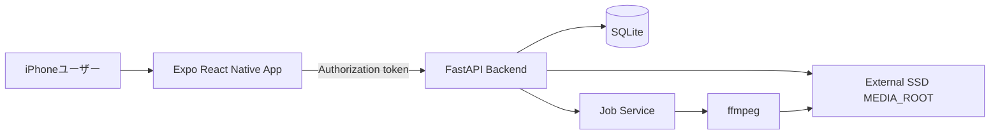
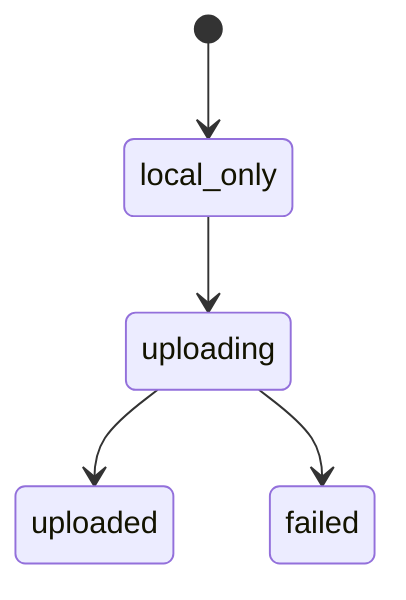
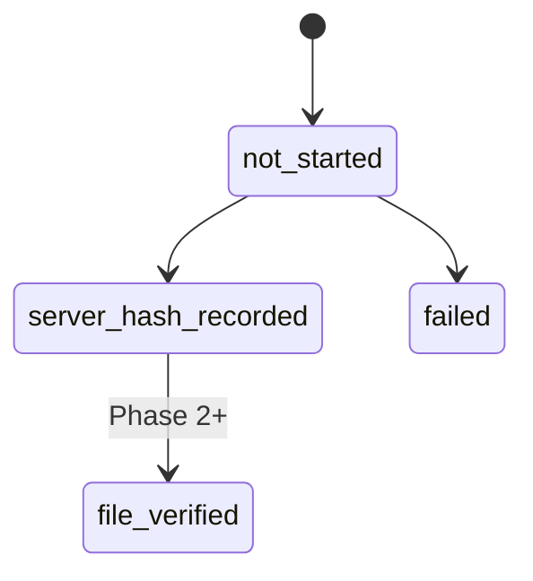
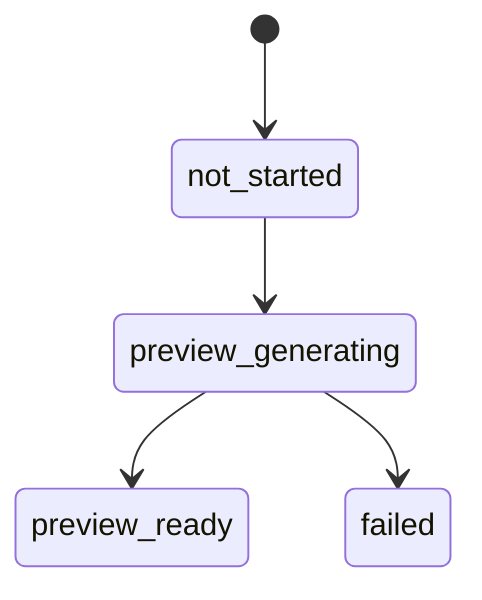

# MediaVault 機能設計書

## 対象範囲

- Phase 1 MVP: `104857600 bytes`以下の素材を通常uploadし、Mac mini側でSHA256記録、preview生成、iPhone側で内容確認する。
- 対象外: chunk/resume、end-to-end hash verification、自動削除、AI解析。
- 将来必須: Phase 2で大容量素材向け安全転送と削除候補判定を追加する。

## システム構成

## 画面構成

| 画面 | 責務 | Phase 1主要操作 |
|------|------|----------------|
| Asset Picker | 写真・動画選択、メタデータ確認、LOG指定 | 選択、LOG toggle、upload開始 |
| Upload Queue | 進捗と失敗状態の確認 | 進捗確認、失敗時再試行 |
| Asset Detail | 素材と処理状態の確認 | SHA256、各status、preview導線確認 |
| Preview Review | preview再生と内容確認 | 再生、確認済みにする |
| Settings | backend接続情報設定 | Backend URL、固定APIトークン保存 |

## Phase 1 ユースケース

### UC-01: 接続設定

1. ユーザーがSettingsでBackend URLと固定APIトークンを入力する。
2. アプリはBackend URLを通常の設定保存領域、固定APIトークンを`expo-secure-store`へ保存する。
3. API要求では`Authorization`ヘッダーを付ける。

### UC-02: 素材upload

1. ユーザーがAsset Pickerで写真・動画を選択する。
2. アプリは取得可能な撮影日時、位置情報、EXIFを読み取る。欠落値はnullにする。
3. ユーザーがLOG素材か選択する。
4. `104857600 bytes`を超える場合、Phase 1対象外としてuploadを開始しない。
5. アプリは`POST /assets/upload`へmultipart uploadする。
6. backendはoriginalを`${MEDIA_ROOT}/originals/`へ保存する。
7. backendはSHA256を計算し、`verification_status = server_hash_recorded`にする。
8. backendはpreview jobを登録する。

### UC-03: preview生成

1. preview jobを`queued`から`running`にする。
2. ffmpegはoriginalを読み取り入力としてpreviewを生成する。
3. 通常動画はH.264 MP4、音声があればAAC、1080p上限で生成する。
4. LOG指定素材は`backend/assets/lut/rec709.cube`を既定とするRec.709変換用LUTを適用する。
5. 写真はJPEG、長辺2048px上限、縦横比維持、EXIF orientation反映で生成する。
6. 成功時は`derived_files`を記録し、`preview_status = preview_ready`とする。
7. 失敗時はjobと`preview_status`を`failed`にし、errorを記録する。

### UC-04: preview確認

1. アプリは`GET /assets/{asset_id}/preview`でpreviewを取得する。
2. ユーザーがpreviewを再生する。
3. ユーザーが確認操作を行う。
4. アプリは`POST /assets/{asset_id}/preview-confirmation`を呼ぶ。
5. backendは`review_status = preview_confirmed`にする。

## API設計

すべてのPhase 1 APIは`Authorization: Bearer <token>`形式の固定APIトークンを要求する。

| Method | Path | 用途 |
|--------|------|------|
| `POST` | `/assets/upload` | originalとメタデータをupload |
| `GET` | `/assets` | asset一覧取得 |
| `GET` | `/assets/{asset_id}` | asset詳細取得 |
| `GET` | `/assets/{asset_id}/preview` | preview取得 |
| `POST` | `/assets/{asset_id}/preview-confirmation` | preview確認済み更新 |
| `GET` | `/jobs` | job一覧取得 |
| `GET` | `/jobs/{job_id}` | job詳細取得 |

### `POST /assets/upload`

- Content-Type: `multipart/form-data`
- Fields: `file`, `type`, `filename`, `taken_at`, `latitude`, `longitude`, `exif_json`, `is_log`
- Validation:
  - fileは必須。
  - sizeは`104857600 bytes`以下。
  - typeは`image`または`video`。
  - original保存先はbackendが生成する。
- Response: asset、`server_sha256`、分離status。

## データモデル

### assets

| Field | 説明 |
|-------|------|
| `id` | asset識別子 |
| `type` | `image` / `video` |
| `filename` | 元ファイル名 |
| `original_path` | backend生成のoriginal保存パス |
| `size` | byte数 |
| `server_sha256` | Mac mini側計算値 |
| `taken_at`, `latitude`, `longitude`, `exif_json` | nullable metadata |
| `is_log` | ユーザー指定LOGフラグ |
| status fields | 転送、検証、preview、確認、削除候補を分離 |

### derived_files

assetから生成した`preview`, `thumbnail`, `proxy`, `lut_preview`を記録する。originalとは別ファイルとして管理する。

### jobs

preview生成と将来解析を共通のjob方式で記録する。Phase 1では`preview`, `lut_preview`を利用する。

## 状態遷移

## エラーハンドリング

| 条件 | backend | mobile |
|------|---------|--------|
| Token不正 | `401`または`403` | Settings確認を促す |
| `104857600 bytes`超過 | `413` | Phase 2対象と表示する |
| 外部SSD未接続 | 保存開始前に失敗 | retry可能として表示する |
| 容量不足 | 保存失敗、error記録 | retry前に環境確認を促す |
| ffmpeg失敗 | jobと`preview_status`を`failed` | preview生成失敗を表示する |
| metadata欠落 | nullで保存 | uploadを妨げない |

## Phase 2設計前提

- `upload_sessions`, `upload_chunks`を追加する。
- chunk hash照合とresumeを実装する。
- upload sessionにiPhone側`expected_file_sha256`を記録する。
- 結合後にMac mini側`server_sha256`を計算し、期待値と一致した場合のみ`file_verified`にする。
- `upload_sessions.status = completed`、全`upload_chunks.status = verified`、assetの`file_verified`, `preview_ready`, `preview_confirmed`を満たす場合のみ削除候補とする。
- 必須条件をすべて満たす場合のみ`safe_to_delete_candidate`にする。
- 実削除は自動化しない。

## Phase 1 Worker契約

- APIとは別に単一workerプロセスを起動する。
- workerはSQLite transaction内で`queued` jobを1件だけatomic claimし、`running`へ更新する。
- jobに`claimed_at`と`lease_expires_at`を記録する。
- worker異常終了時は、lease期限切れの`running` jobを`queued`へ戻して再実行可能にする。
- SQLiteはWAL modeと`busy_timeout = 5000ms`を設定する。
- Dockerではworkerを独立serviceとして起動し、`restart: unless-stopped`を設定する。

## テスト観点

- original保存後に内容が変更されない。
- `104857600 bytes`超過を拒否する。
- Tokenなし要求を拒否する。
- metadata欠落を許容する。
- LOG指定時だけRec.709 LUT previewを生成する。
- preview確認が`review_status`だけを更新する。
- iCloud-only素材、ライブラリ権限拒否、metadata欠落をDevelopment Build実機で確認する。
