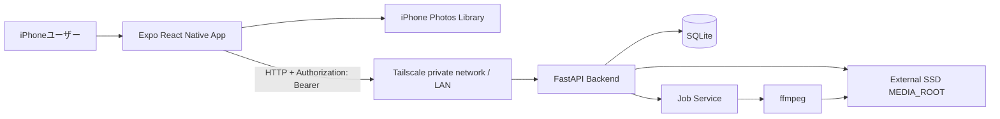
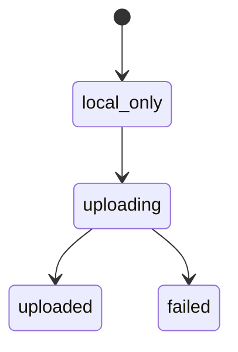
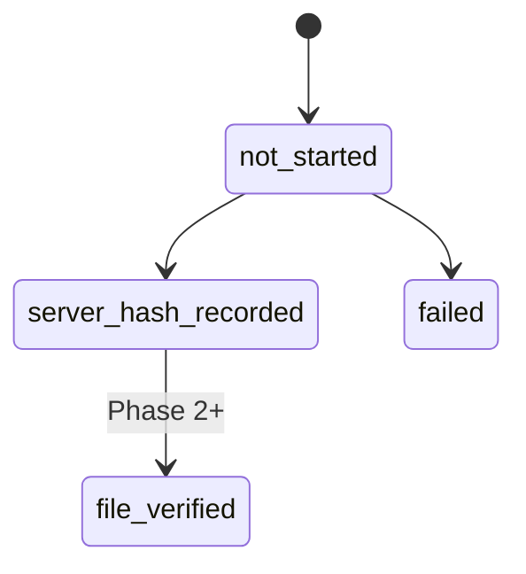
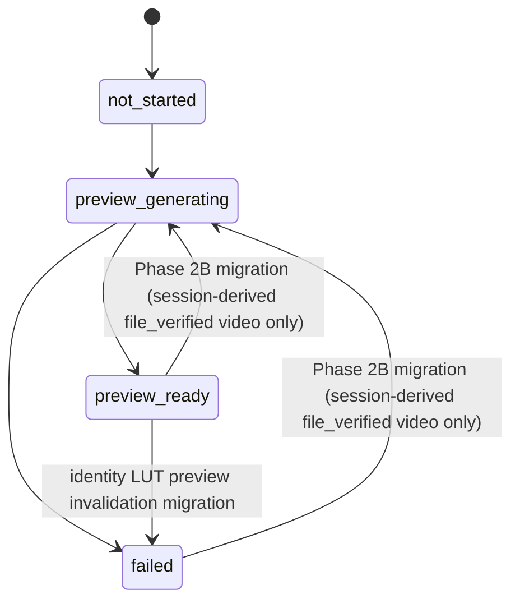
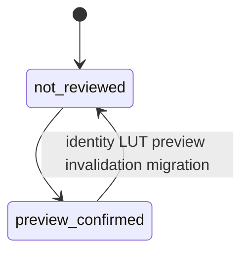
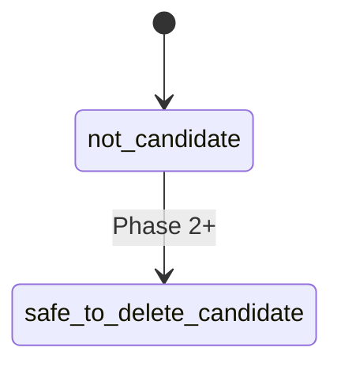
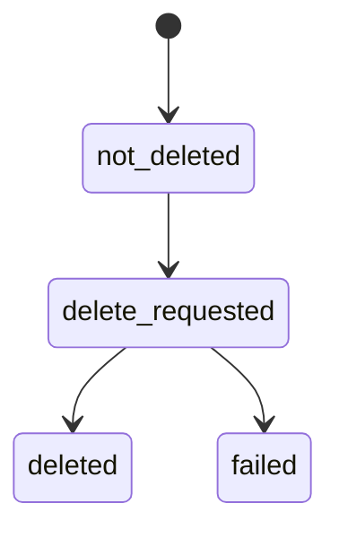

# MediaVault 機能設計書

## 対象範囲

- Phase 1 MVP: `104857600 bytes`以下の素材を通常uploadし、Mac mini側でSHA256記録、preview生成、iPhone側で内容確認する。
- 対象外: chunk/resume、end-to-end hash verification、自動削除、AI解析。
- preview確認後のiPhone側original削除は、ユーザー明示操作だけを許可する。Backend側original削除は対象外とする。
- iPhoneからbackendへのPhase 1接続は、LANまたはTailscale private network上のHTTP endpointと固定APIトークンを使う。
- 将来必須: Phase 2Aで大容量素材向け安全転送、Phase 2BでApple Log preview、Phase 2Cで削除候補判定を追加する。
- Phase 2Bでは、`file_verified` originalだけを入力にApple Logを自動判定する。要求LUTが未登録または無効化済みなら、未変換を明示した`compress-only` previewを成功として返す。
- Mobileはサーバーが返す有効なプリセットだけを選択する。custom LUTのファイルをMobileからuploadしない。

## システム構成

```mermaid
graph LR
    User[iPhoneユーザー]
    Mobile[Expo React Native App]
    Photos[iPhone Photos Library]
    Tailnet[Tailscale private network / LAN]
    API[FastAPI Backend]
    DB[(SQLite)]
    Jobs[Job Service]
    FFmpeg[ffmpeg]
    SSD[External SSD MEDIA_ROOT]

    User --> Mobile
    Mobile --> Photos
    Mobile -->|HTTP + Authorization: Bearer <token>| Tailnet
    Tailnet --> API
    API --> DB
    API --> SSD
    API --> Jobs
    Jobs --> FFmpeg
    FFmpeg --> SSD
```

## 画面構成

| 画面 | 責務 | Phase 1主要操作 |
|------|------|----------------|
| Asset Picker | 写真・動画選択、メタデータ確認、LOG指定 | 選択、LOG toggle、upload開始 |
| Upload Queue | 進捗と失敗状態の確認 | 進捗確認、失敗時再試行 |
| Asset Detail | 素材と処理状態の確認 | SHA256、各status、要求・適用プリセット、未変換表示、preview導線確認 |
| Preview Review | preview再生、内容確認、iPhone側original削除導線 | 再生、色変換状態確認、確認済みにする、手動削除 |
| Settings | backend接続情報設定 | サーバー名、Backend URL、固定APIトークン保存 |

## Phase 1 ユースケース

### UC-01: 接続設定

1. ユーザーがSettingsでサーバー名、Backend URL、固定APIトークンを手入力する。初期リリースにQRコードによる設定インポートは含めない。
2. 自宅用Backend URLは`http://<tailscale-ip>:8000`または`http://<magicdns-name>:8000`のようなprivate endpointを許容する。将来のApp Review用接続先は独立したHTTPS endpointだけを許容する。
3. アプリはサーバー名とBackend URLを通常の設定保存領域、固定APIトークンをサーバーIDごとの`expo-secure-store`へ保存する。
4. API要求では選択中サーバーの`Authorization`ヘッダーを付ける。
5. Tailscaleは到達経路であり、固定APIトークン認証は省略しない。

### UC-02: 素材upload

1. ユーザーがAsset Pickerで写真・動画を選択する。
2. アプリは取得可能な撮影日時、位置情報、EXIFを読み取る。`taken_at` は秒精度の ISO 8601 datetime に正規化し、欠落または正規化不能な値はnullにする。
3. ユーザー指定のLOGフラグはmetadata検出のhintとして送信する。正式なApple Log判定はBackendがoriginal確定後に行う。
4. `104857600 bytes`を超える場合、Phase 1対象外としてuploadを開始しない。
5. アプリは`POST /assets/upload`へmultipart uploadする。
6. backendはoriginalを`${MEDIA_ROOT}/originals/`へ保存する。
7. backendはSHA256を計算し、`verification_status = server_hash_recorded`にする。
8. backendはpreview jobを登録する。

### UC-03: preview生成

1. preview jobを`queued`から`running`にする。
2. ffmpegはoriginalを読み取り入力としてpreviewを生成する。
3. 通常動画はH.264 MP4、音声があればAAC、1080p上限で生成する。
4. Phase 2B以降、`file_verified` originalに対してBackendがApple Logを自動判定する。Apple Logには利用可能なら`generated-apple-log-rec709`を既定として適用し、ユーザーが有効なcustom LUTを選択した場合はその選択を優先する。
5. 要求プリセットが未登録または無効化済みなら、Backendは`compress-only`で軽量化したpreviewを生成する。jobは`done`、`preview_status = preview_ready`とし、`color_transform_status = unavailable`、`color_transform_error_code = lut_preset_unavailable`、要求・適用プリセットを記録する。MobileはApple Log未変換であることを表示する。
6. 登録済みLUTのmanifest検証、SHA-256、形式、FFmpeg適用に失敗した場合は、jobと`preview_status`を`failed`にし、previewを配信しない。
7. 写真はJPEG、長辺2048px上限、縦横比維持、EXIF orientation反映で生成する。
8. 成功時は`derived_files`とformal preview provenanceを記録し、`preview_status = preview_ready`とする。
9. 失敗時はjobと`preview_status`を`failed`にし、errorを記録する。

### UC-04: preview確認

1. アプリは`GET /assets/{asset_id}/preview`でpreviewを取得する。
2. アプリは要求・適用プリセットと色変換状態を表示する。未変換Apple LogはRec.709変換済みと表示しない。
3. ユーザーがpreviewを再生する。
4. ユーザーが確認操作を行う。
5. アプリは`POST /assets/{asset_id}/preview-confirmation`を呼ぶ。
6. backendは`review_status = preview_confirmed`にする。

### UC-05: preview確認後のiPhone側original手動削除

1. アプリはasset詳細とpreview状態を取得する。
2. `preview_status = preview_ready`かつ`review_status = preview_confirmed`の場合だけ削除操作を表示する。
3. アプリは対象asset、filename、撮影日時などを表示し、ユーザーの明示確認を求める。
4. アプリはupload時に保持したiPhone写真ライブラリのlocal asset identifierを使い、`expo-media-library` service経由で削除を要求する。
5. iOS側確認、権限拒否、ユーザーキャンセル、local asset不在をそれぞれ扱う。
6. 成功時はMobile側のlocal状態を`deleted`にする。Backend側original、derived file、asset statusは削除しない。

## API設計

すべてのPhase 1 APIは`Authorization: Bearer <token>`形式の固定APIトークンを要求する。Phase 1はLANまたはTailscale private network内のHTTP endpointを許容するが、公開インターネット上のHTTP endpointは対象外とする。

| Method | Path | 用途 |
|--------|------|------|
| `POST` | `/assets/upload` | originalとメタデータをupload |
| `GET` | `/assets` | asset一覧取得 |
| `GET` | `/assets/{asset_id}` | asset詳細取得 |
| `GET` | `/assets/{asset_id}/preview` | preview取得 |
| `GET` | `/assets/{asset_id}/results/{result_id}` | active processed videoの取得 |
| `POST` | `/assets/{asset_id}/preview-confirmation` | preview確認済み更新 |
| `GET` | `/jobs` | job一覧取得 |
| `GET` | `/jobs/{job_id}` | job詳細取得 |

### Phase 2A processed result API契約

- Asset Detailだけがnullableな`active_processed_result`を返す。metadataは32桁lowercase UUID hexの`result_id`、`mime_type`、`size_bytes`、SHA-256、作成時刻、canonical relative URLだけとし、filesystem path、token、original pathは返さない。asset listには含めない。
- `GET /assets/{asset_id}/results/{result_id}`はBearer tokenを要求し、asset/resultを同時に検索する。未知または別assetのresultは`404 processed_result_not_found`、inactive historical resultは`409 processed_result_superseded`、activeでない又はintegrity/provenance gateを満たさないresultは`409 processed_result_not_ready`とする。
- full responseは`200`、single rangeは`206`、malformed又はunsatisfiable rangeは`416 processed_result_range_not_satisfiable`とする。成功responseは`ETag`、`X-Processed-Result-Id`、`X-Processed-Result-SHA256`、`X-Processed-Result-Size`、`Accept-Ranges`、正しい`Content-Length`を返す。
- Mobileはdetailのmetadataを捕捉し、asset/result IDからcanonical pathを再構築したsame-origin requestだけにAuthorization headerを付与する。`video/mp4`だけをtemporary `.mp4`へdownloadし、header、size、native streaming SHA-256を照合してから写真ライブラリへ保存する。
- `processedResultSaveStore`はsource originalの`mobile local asset mapping`とは別のAsyncStorage namespaceである。`unknown` write-ahead markerを`createAssetAsync`直前に保存し、成功時だけ`saved_local_asset_identifier`を記録してからtemporary fileをbest-effort cleanupする。

### Phase 2B API契約

- 動画の入力経路はPhase 2Aのupload sessionで確定した`file_verified` assetだけとし、変換用にoriginalを別経路で再uploadしない。
- versioned APIは、サーバーの`capabilities`、利用可能なpreset一覧、assetに紐づくpreview jobの進捗と結果を提供する。具体的なpathとrequest/response schemaはPhase 2B feature specで固定する。
- preset一覧は`compress-only`を必ず含み、Mobileは返却された有効presetだけを表示する。
- preview/job結果は`requested_preset_id`、`applied_preset_id`、`color_transform_status`、必要時の`color_transform_error_code`を返す。未登録または無効化済みpresetへのfallbackでは`color_transform_error_code = lut_preset_unavailable`を返す。

### `POST /assets/upload`

- Content-Type: `multipart/form-data`
- Fields: `file`, `type`, `filename`, `taken_at`, `latitude`, `longitude`, `exif_json`, `is_log`
- Validation:
  - fileは必須。
  - sizeは`104857600 bytes`以下。
  - typeは`image`または`video`。
  - `taken_at` は空文字または秒精度の `YYYY-MM-DDTHH:mm:ss`、`Z`、`+HH:mm`、`-HH:mm` を含む同形式のみ。date-only、space区切り、offset-only、文字列`null`は拒否する。
  - original保存先はbackendが生成する。
- Response: asset、`server_sha256`、分離status。

## データモデル

### assets

| Field | 説明 |
|-------|------|
| `id`, `active_processed_result_id`, `formal_preview_id`, `preview_generation` | asset識別子、Phase 2Aのactive immutable resultを指すnullable identifier、Phase 2Bでactive formal previewを指すnullable derived file識別子、formal previewを無効化するたびに増加するnon-null世代番号 |
| `type` | `image` / `video` |
| `filename` | 元ファイル名 |
| `original_path` | backend生成のoriginal保存パス |
| `size` | byte数 |
| `server_sha256` | Mac mini側計算値 |
| `taken_at`, `latitude`, `longitude`, `exif_json` | nullable metadata。`taken_at` は秒精度 ISO 8601 datetimeのみ |
| `is_log` | legacyのユーザー指定LOG hint。正式変換の根拠にはしない |
| `log_detection_status`, `log_profile`, `log_detection_rule_version`, `log_detection_evidence_json` | Phase 2Bで記録する`apple_log`/`not_log`/`unknown`判定、nullable profile、rule version、bounded evidence summary。`is_log`とは別に扱う |
| status fields | 転送、検証、preview、確認、削除候補を分離 |

### mobile local asset mapping

iPhone写真ライブラリ上の素材とbackend assetを紐づけるMobile側local state。Backend DBにはiPhone内ファイルを削除するための権限やpathを持たせない。mappingが取得できない場合は`mapping_unavailable`を派生local状態として扱い、将来の削除操作を表示しない。backend asset idやfilenameからlocal assetを推測しない。

| Field | 説明 |
|-------|------|
| `backend_asset_id` | upload後のasset識別子 |
| `local_asset_identifier` | `expo-media-library`から得るiPhone写真ライブラリ上の識別子 |
| `local_delete_status` | `not_deleted`, `delete_requested`, `deleted`, `failed` |
| `last_delete_error` | 権限拒否、キャンセル、local asset不在などの表示用分類 |

### processed result save store

処理済みvideoをiPhone写真ライブラリへ保存するためのMobile側local state。source originalのmappingとは独立し、Backendへ同期しない。token、URI、storage path、source originalのlocal asset identifierは保存しない。

| Field | 説明 |
|-------|------|
| `backend_asset_id`, `backend_result_id`, `result_sha256` | exact result identityを構成するkey |
| `save_status` | `downloading`, `unknown`, `saved`, `failed` |
| `saved_local_asset_identifier` | `saved`時だけ保持する処理済みcopyの写真ライブラリ識別子 |
| `save_attempted_at`, `last_error_code`, `updated_at` | write-ahead recoveryと安全な表示用metadata |

### upload result unknown

Mobileがupload timeout後にbackend保存結果を確定できないlocal state。token、URI、filenameを保存せず、local asset idがある場合はその値で状態を復元する。local asset idがない場合はglobal pending markerを使い、ユーザーがasset一覧を確認済みと明示するまでuploadを再開しない。

### derived_files

assetから生成した`preview`, `thumbnail`, `proxy`, `lut_preview`を記録する。originalとは別ファイルとして管理する。Phase 2Bのformal previewはすべて一対一のpreview provenanceを持つ。provenanceは`requested_preset_id`、`applied_preset_id`、preset version、SHA-256、`color_transform_status`、nullableな`color_transform_error_code`を記録する。Apple LogのRec.709変換と有効なcustom LUTは`transform_kind = lut`、未登録・無効化済みpresetへのfallbackと非Logは`transform_kind = none`とする。Apple Log fallbackでは未変換理由として`color_transform_error_code = lut_preset_unavailable`を必須にする。

### processed_results

deliverableなvideo derived fileのimmutable identity。`id`はopaqueな32桁lowercase UUID hex、`asset_id`と`derived_file_id`はFK、`derived_file_id`は一意とする。`ready` resultだけがactive pointerになれ、pointerの切替では旧resultを`superseded`として保持する。`ready`又は`superseded` resultのderived file、MIME、size、SHA-256、generation、created timeは変更・削除できない。Phase 2Bではdelivery前にresult、`formal_preview_id`、generation、formal provenanceの一致を追加で確認する。

### jobs

preview生成と将来解析を共通のjob方式で記録する。Phase 1では`preview`, `lut_preview`を利用する。Phase 2Aはsessionごとに一意な`upload_finalize` jobを追加し、Phase 2Bは新規動画にprofile-awareな`preview` jobを使う。preview jobは要求presetをsnapshotし、完了時に実際に適用したpresetと色変換状態をprovenanceへ確定する。non-nullの`jobs.dedup_key`は一意とし、finalize/preview migrationの重複jobを防ぐ。`jobs.preview_generation`はnon-preview jobではnull、session由来video previewでは必須で、workerはassetの`preview_generation`とclaim/commitの両方で一致するjobだけがassetを更新できる。

## 状態遷移

### transfer_status

```mermaid
stateDiagram-v2
    [*] --> local_only
    local_only --> uploading
    uploading --> uploaded
    uploading --> failed
```

### verification_status

```mermaid
stateDiagram-v2
    [*] --> not_started
    not_started --> server_hash_recorded
    server_hash_recorded --> file_verified: Phase 2+
    not_started --> failed
```

### preview_status

```mermaid
stateDiagram-v2
    [*] --> not_started
    not_started --> preview_generating
    preview_generating --> preview_ready
    preview_generating --> failed
    preview_ready --> failed: identity LUT preview invalidation migration
    preview_ready --> preview_generating: Phase 2B migration (session-derived file_verified video only)
    failed --> preview_generating: Phase 2B migration (session-derived file_verified video only)
```

Apple Log assetは、正式なpreview provenanceを持つderived previewだけ`preview_ready`になれる。要求presetが未登録または無効化済みなら、`transform_kind = none`かつ`color_transform_status = unavailable`のprovenanceを持つ未変換previewを`preview_ready`にできる。登録済みLUTの検証・適用失敗だけは`failed`へ遷移する。
Phase 2B migrationは、上記2遷移で旧previewを再生成する場合だけを許可し、同一assetに一意なprofile-aware jobを作る。`INSERT ... ON CONFLICT(dedup_key) DO NOTHING`が新jobを返した場合だけ、同一transactionで`preview_generation`を増やしてasset stateを更新する。既存dedup keyがあればasset stateは変えない。Phase 1 direct assetはこの再生成遷移の対象外とする。旧generationのjobは`preview_generation_superseded`としてassetを変更せず終了する。

### review_status

```mermaid
stateDiagram-v2
    [*] --> not_reviewed
    not_reviewed --> preview_confirmed
    preview_confirmed --> not_reviewed: identity LUT preview invalidation migration
```

### delete_candidate_status

```mermaid
stateDiagram-v2
    [*] --> not_candidate
    not_candidate --> safe_to_delete_candidate: Phase 2+
```

### local_delete_status

```mermaid
stateDiagram-v2
    [*] --> not_deleted
    not_deleted --> delete_requested
    delete_requested --> deleted
    delete_requested --> failed
```

## エラーハンドリング

| 条件 | backend | mobile |
|------|---------|--------|
| Token不正 | `401`または`403` | Settings確認を促す |
| Backend URL到達不可 | なし | Tailscale接続、URL、backend起動状態を確認する |
| `104857600 bytes`超過 | `413` | Phase 2対象と表示する |
| 外部SSD未接続 | 保存開始前に失敗 | retry可能として表示する |
| 容量不足 | 保存失敗、error記録 | retry前に環境確認を促す |
| ffmpeg失敗 | jobと`preview_status`を`failed` | preview生成失敗を表示する |
| 要求LUTが未登録または無効化済み | `compress-only` previewを`done`かつ`preview_ready`で記録し、`lut_preset_unavailable`をprovenanceへ保存 | 未変換Apple Logまたは未適用LUTとして表示し、再生・confirmationを許可する |
| 登録済みLUTのmanifest、hash、形式、FFmpeg適用失敗 | `preview_status`を`failed` | preview再生・confirmationを表示しない |
| upload timeout | backend結果は不明 | `result_unknown`を再起動後も復元し、一覧確認済みの明示操作まで再送しない |
| metadata欠落 | nullで保存 | uploadを妨げない |
| iPhone側削除権限拒否 | 変更なし | 削除未実行として表示する |
| iPhone側削除キャンセル | 変更なし | 削除未実行として表示する |
| local asset不在 | 変更なし | 端末内で見つからない素材として表示する |
| processed resultがinactive | `409 processed_result_superseded` | Asset Detailを再取得し、別resultを自動保存しない |
| processed resultが未ready又は不整合 | `409 processed_result_not_ready` | 保存を開始せず、詳細を更新する |
| result header/size/SHA-256不一致 | 変更なし | temporary fileを削除し、写真ライブラリへ保存しない |
| 写真ライブラリ保存後の状態書込み失敗 | 変更なし | `unknown`を維持し、savedと表示しない |

## Phase 2設計前提

- `upload_sessions`, `upload_chunks`を追加する。
- 新規動画の`POST /assets/upload`を`409 video_session_required`で拒否し、session APIだけで受理する。
- sessionに一意な`client_upload_id`、iPhone側`expected_file_sha256`、固定chunk size、expiry、failure class、retryable、finalization job/asset参照を記録する。
- chunkに`UNIQUE(session_id, chunk_index)`、range、size、verified SHA256を記録し、同一hashの再送だけを冪等成功にする。`chunk_verified`はasset statusではなくupload chunk statusだけで表す。
- session create/status/chunk/finalize/cancel APIは固定token認証を必須にし、finalizeは非同期`upload_finalize` jobとしてlease回復可能にする。
- retryable finalization failureは同一jobを`failed -> queued`へ戻して`failed -> assembling`へ再遷移できる。attempt countを記録し、terminal failureは再queueしない。
- 結合後にMac mini側`server_sha256`を計算し、期待値と一致した場合のみ`file_verified`にする。
- `upload_sessions.status = completed`、全`upload_chunks.status = verified`、assetの`file_verified`, provenance付き`preview_ready`, `preview_confirmed`を満たす場合のみ削除候補とする。
- Apple Logの未変換fallbackも、`transform_kind = none`、`color_transform_status = unavailable`、未変換表示用情報を持つformal provenanceなら削除候補のpreview条件を満たす。
- 必須条件をすべて満たす場合のみ`safe_to_delete_candidate`にする。
- `safe_to_delete_candidate`は削除操作の自動実行ではなく、ユーザーへ削除候補として提示できる状態を表す。
- 実削除はPhase 2以降も自動化しない。

## Phase 1 Worker契約

- APIとは別に単一workerプロセスを起動する。
- workerはSQLite transaction内で`queued` jobを1件だけatomic claimし、`running`へ更新する。
- preview jobのterminal failureでは、jobと存在するassetのstatusを同一SQLite transactionで更新する。
- Phase 2Aでは`upload_finalize` workerがoriginalの結合、hash照合、確定保存を行い、asset/session/job完了とpreview job登録を同一transactionで確定する。Phase 2B migrationはmaintenance modeでpre-Phase-2B workerを停止・drainしてから、session由来の`file_verified`動画だけを一意なprofile-aware preview jobへ再queueする。job insertが新規の場合だけgeneration、formal preview/review stateを同一transactionで更新する。workerはclaim/commit時のgeneration不一致を`preview_generation_superseded`としてassetを書き換えずに終了する。Phase 1 direct assetは対象外とする。
- jobに`claimed_at`と`lease_expires_at`を記録する。
- worker異常終了時は、lease期限切れの`running` jobを`queued`へ戻して再実行可能にする。
- SQLiteはWAL modeと`busy_timeout = 5000ms`を設定する。
- Dockerではworkerを独立serviceとして起動し、`restart: unless-stopped`を設定する。

## テスト観点

- original保存後に内容が変更されない。
- `104857600 bytes`超過を拒否する。
- Tokenなし要求を拒否する。
- metadata欠落を許容する。
- Apple Logを自動判定し、利用可能なRec.709 presetでは変換済みpreviewを生成する。未登録または無効化済みpresetでは、未変換表示付き`compress-only` previewを生成する。
- identity LUTで生成済みのLOG previewはRec.709変換済みとして扱わず、要求・適用presetと色変換状態がないpreviewは確認・削除導線に使えない。
- upload timeout後に同一素材を自動または即時に再送しない。
- `result_unknown`はlocal asset idまたはglobal pending markerで再起動後も復元し、一覧確認済みの明示操作までuploadを再開しない。
- 未登録LUTのApple Log assetが`preview_ready`、`color_transform_status = unavailable`、未変換表示となり、preview再生、confirmation、削除導線を表示できることを実機またはcomponent testで確認する。登録済みだが不正なLUTは`failed`となり、同導線を表示しないことも確認する。
- Phase 2B migrationがsession由来の`file_verified`動画だけを`preview_ready -> preview_generating`または`failed -> preview_generating`へ遷移し、新規dedup jobのinsert成功時だけgeneration/formal preview/review stateを更新することを確認する。queued、done、failedのPhase 2B jobが既にあるmigration再実行ではasset stateを変えず、jobを重複作成しないことを確認する。
- Phase 2B migration後にgeneration `0`のPhase 2A preview/lut_preview jobをclaimまたはlease recoveryしても、`preview_generation_superseded`としてasset、formal preview、review state、derived file、provenanceを変更しないことを確認する。migration開始前にpre-Phase-2B workerを停止・drainしないdeploymentを拒否することも確認する。
- mappingが取得できないassetは、将来のiPhone側original削除導線を表示しない。
- preview確認が`review_status`だけを更新する。
- iPhone側original削除操作がpreview確認後にだけ表示される。
- 削除権限拒否、ユーザーキャンセル、local asset不在でBackend側statusが変わらない。
- iCloud-only素材、ライブラリ権限拒否、metadata欠落、Tailscale経由のBackend URL到達をDevelopment Build実機で確認する。
