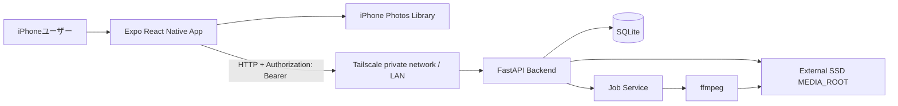
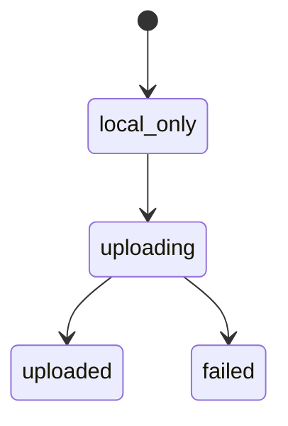
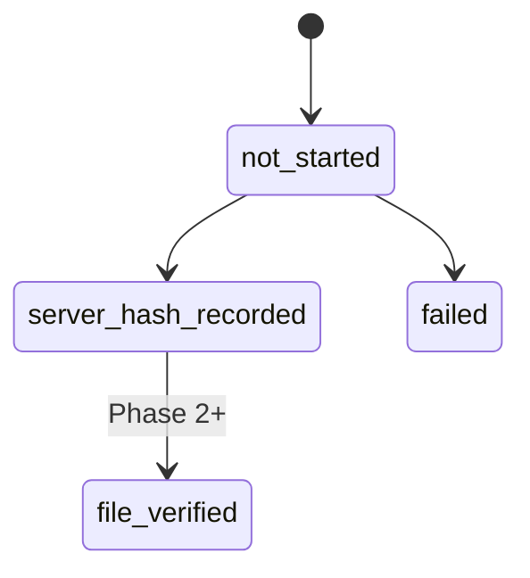
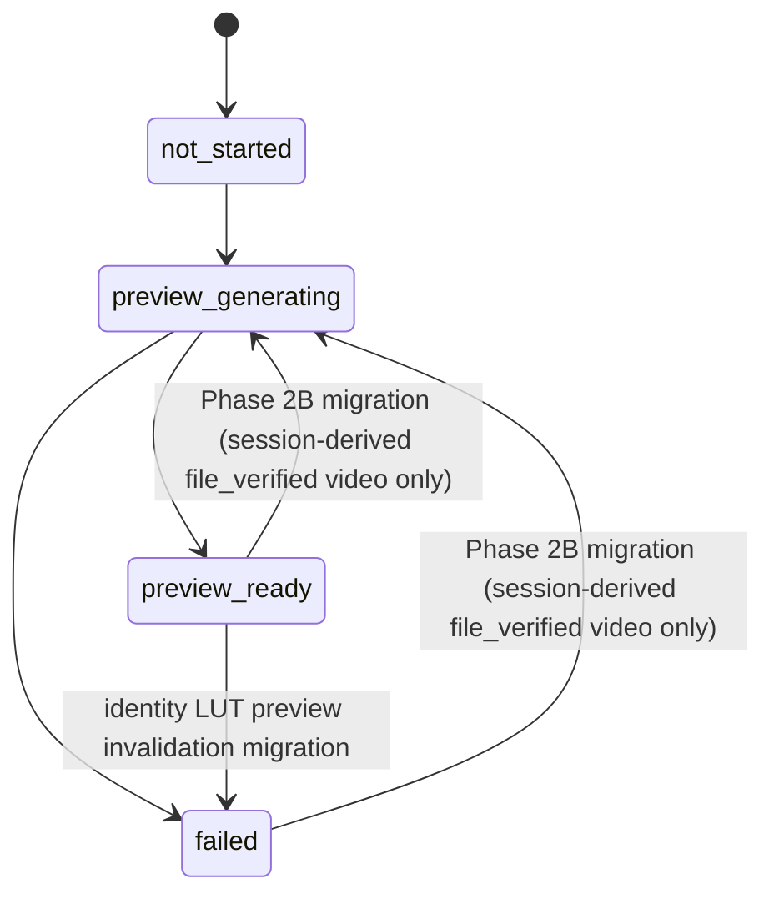
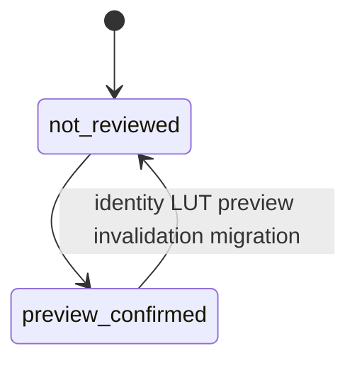
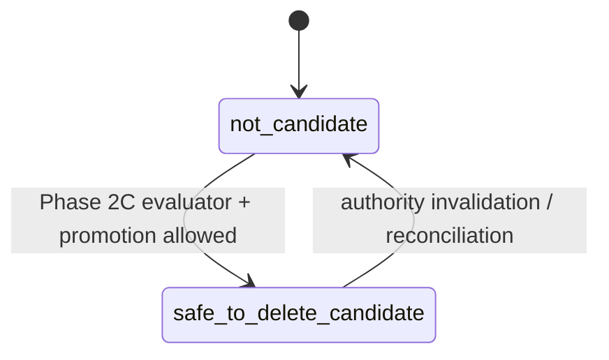
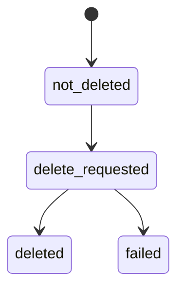

# MediaVault 機能設計書

## 対象範囲

- Phase 1 MVP: `104857600 bytes`以下の素材を通常uploadし、Mac mini側でSHA256記録、preview生成、iPhone側で内容確認する。
- 対象外: chunk/resume、end-to-end hash verification、自動削除、AI解析。
- preview確認後のiPhone側original削除は、ユーザー明示操作だけを許可する。Backend側original削除は対象外とする。
- iPhoneからbackendへのPhase 1接続は、LANまたはTailscale private network上のHTTP endpointと固定APIトークンを使う。
- 将来必須: Phase 2Aで大容量素材向け安全転送、Phase 2BでApple Log preview、Phase 2Cで削除候補判定を追加する。
- Phase 2Aでは、通常video向けmanaged preset renditionをPhase 2Bの前段として提供する。これはApple Log自動判定又はformal previewではなく、preview確認・review・削除候補状態を変更しない。
- Phase 2B detector-v2では、`file_verified` originalだけをsame-fd bounded parserとFFprobeで検査し、Apple Log 1/2をclosed `source_profile`として判定する。0.4.0では両profileを未変換と明示した`compress-only` previewとして返し、LUTを生成・登録・適用しない。
- Mobileはサーバーが返す有効なプリセットだけを選択する。custom LUTのファイルをMobileからuploadしない。

## システム構成

```mermaid
graph LR
    User[iPhoneユーザー]
    Mobile[Expo React Native App]
    Photos[iPhone Photos Library]
    Tailnet[Tailscale private network / LAN]
    API[FastAPI Backend]
    DB[(SQLite)]
    Jobs[Job Service]
    FFmpeg[ffmpeg]
    SSD[External SSD MEDIA_ROOT]

    User --> Mobile
    Mobile --> Photos
    Mobile -->|HTTP + Authorization: Bearer <token>| Tailnet
    Tailnet --> API
    API --> DB
    API --> SSD
    API --> Jobs
    Jobs --> FFmpeg
    FFmpeg --> SSD
```

## 画面構成

| 画面 | 責務 | Phase 1主要操作 |
|------|------|----------------|
| Asset Picker | 写真・動画選択、メタデータ確認、LOG指定 | 選択、LOG toggle、upload開始 |
| Asset Detail | 素材と処理状態の確認 | SHA256、各status、要求・適用プリセット、未変換表示、preview導線確認 |
| Preview Review | preview再生、内容確認、iPhone側original削除導線 | 再生、色変換状態確認、確認済みにする、手動削除 |
| Settings | backend接続情報設定 | 1つのBackend URLと固定APIトークンを保存 |

## Phase 1 ユースケース

### UC-01: 接続設定

1. ユーザーがSettingsで1つのBackend URLと固定APIトークンを手入力する。初期リリースにserver name/ID、複数profile、QR importは含めない。
2. HTTPはRFC1918、Tailscale IPv4、single-label MagicDNS、`.local`だけを許容し、
   有効なHTTPS originも許容する。public HTTPやqualified `.ts.net` HTTPは拒否する。
3. URLとselected tokenを両方検証してから、URLを通常設定保存領域、
   tokenを既存の`expo-secure-store` keyへ保存する。空のreplacement tokenでは保存済みtokenを維持する。
4. 保存時と各通信境界で同じURL policyを再評価し、拒否時はAuthorization headerを構築せずnetwork adapterを呼ばない。
5. Tailscaleは到達経路であり、固定APIトークン認証は省略しない。

### UC-02: 素材upload

1. ユーザーがAsset Pickerで写真・動画を選択する。
2. アプリは取得可能な撮影日時、位置情報、EXIFを読み取る。`taken_at` は秒精度の ISO 8601 datetime に正規化し、欠落または正規化不能な値はnullにする。
3. ユーザー指定のLOGフラグはmetadata検出のhintとして送信する。正式なApple Log判定はBackendがoriginal確定後に行う。
4. `104857600 bytes`を超える場合、Phase 1対象外としてuploadを開始しない。
5. アプリは`POST /assets/upload`へmultipart uploadする。
6. backendはoriginalを`${MEDIA_ROOT}/originals/`へ保存する。
7. backendはSHA256を計算し、`verification_status = server_hash_recorded`にする。
8. backendはpreview jobを登録する。

### UC-03: preview生成

1. preview jobを`queued`から`running`にする。
2. ffmpegはoriginalを読み取り入力としてpreviewを生成する。
3. 通常動画はH.264 MP4、音声があればAAC、1080p上限で生成する。
4. Phase 2B detector-v2以降、Backendはverified originalをno-followで1回だけopenする。同じdescriptorをbounded ISO BMFF parserとFFprobeへ渡し、選択video trackのsample description直下にある`logs`だけを識別根拠にする。
5. `com.apple.rec2020.apple-log`は`apple-log-1`、`com.apple.apple-wide-gamut.apple-log`は`apple-log-2`へ分類する。前者は`generated-apple-log-rec709`、後者は`generated-apple-log2-rec709`をrequested presetとして記録する。
6. 0.4.0では両予約presetをabsentまたはdisabledに限定し、Backendは`compress-only`で軽量化したpreviewを生成する。jobは`done`、`preview_status = preview_ready`とし、profile別requested preset、`applied_preset_id = compress-only`、`transform_kind = none`、`color_transform_status = unavailable`、`color_transform_error_code = lut_preset_unavailable`を記録する。
7. parserのstable container errorはattempt/job/assetをterminal failureへ収束させ、derived file/resultを公開しない。将来のApple Log applied/LUT tupleも0.4.0ではformal authorityとして拒否する。
8. 写真はJPEG、長辺2048px上限、縦横比維持、EXIF orientation反映で生成する。
9. 成功時は`derived_files`とformal preview provenanceを記録し、`preview_status = preview_ready`とする。
10. 失敗時はjobと`preview_status`を`failed`にし、errorを記録する。

### UC-04: preview確認

1. アプリは`GET /assets/{asset_id}/preview`でpreviewを取得する。
2. アプリは`Apple Log 1 (unconverted)`または`Apple Log 2 (unconverted)`をshared pure helperで表示する。generic Apple Log labelやapplied transform labelを合成せず、Rec.709変換済みと表示しない。
3. ユーザーがpreviewを再生する。
4. ユーザーが確認操作を行う。
5. アプリは`POST /assets/{asset_id}/preview-confirmation`を呼ぶ。
6. backendは`review_status = preview_confirmed`にする。

### UC-05: preview確認後のiPhone側original手動削除

1. アプリはasset詳細とpreview状態を取得する。
2. 共通条件として`preview_status = preview_ready`、
   `review_status = preview_confirmed`、local mapping available、未削除、非busyを要求する。
3. Phase 1 direct assetは`verification_status = server_hash_recorded`を追加条件とし、
   formal capabilityを要求しない。Phase 2 session videoは`type = video`かつ
   `verification_status = file_verified`に加え、0.4.0 header付きAsset Detail、compatible capability、
   `formal_preview.state = ready`を要求する。detail/capability refresh失敗、409、sanitizer拒否、candidate不一致ではnative削除へ進まない。
4. アプリは対象asset、filename、撮影日時などを表示し、ユーザーの明示確認を求める。
5. アプリはupload時に保持したiPhone写真ライブラリのlocal asset identifierを使い、`expo-media-library` service経由で削除を要求する。
6. iOS側確認、権限拒否、ユーザーキャンセル、local asset不在をそれぞれ扱う。
7. native成功直後にMobile memoryをterminal `deleted`へ遷移する。Backend側original、
   derived file、asset statusは削除しない。

## API設計

すべてのPhase 1 APIは`Authorization: Bearer <token>`形式の固定APIトークンを要求する。Phase 1はLANまたはTailscale private network内のHTTP endpointを許容するが、公開インターネット上のHTTP endpointは対象外とする。

| Method | Path | 用途 |
|--------|------|------|
| `POST` | `/assets/upload` | originalとメタデータをupload |
| `GET` | `/assets` | asset一覧取得 |
| `GET` | `/assets/{asset_id}` | asset詳細取得 |
| `GET` | `/assets/{asset_id}/preview` | preview取得 |
| `GET` | `/assets/{asset_id}/results/{result_id}` | active processed videoの取得 |
| `POST` | `/assets/{asset_id}/preview-confirmation` | preview確認済み更新 |
| `GET` | `/api/v1/capabilities` | versioned feature capability取得 |
| `GET` | `/api/v1/presets` | selectable managed preset取得 |
| `POST` | `/api/v1/assets/{asset_id}/renditions` | managed rendition作成 |
| `GET` | `/api/v1/assets/{asset_id}/renditions/{rendition_id}` | managed rendition進捗取得 |

Backendのjobs table、claim/lease/statusは内部実行modelとして維持するが、
`GET /jobs`、job detail API、専用Upload Queue画面は初期リリースで公開しない。

### Phase 2A processed result API契約

- Asset Detailだけがnullableな`active_processed_result`を返す。metadataは32桁lowercase UUID hexの`result_id`、`mime_type`、`size_bytes`、SHA-256、作成時刻、canonical relative URLだけとし、filesystem path、token、original pathは返さない。asset listには含めない。
- `GET /assets/{asset_id}/results/{result_id}`はBearer tokenを要求し、asset/resultを同時に検索する。未知または別assetのresultは`404 processed_result_not_found`、inactive historical resultは`409 processed_result_superseded`、activeでない又はintegrity/provenance gateを満たさないresultは`409 processed_result_not_ready`とする。
- full responseは`200`、single rangeは`206`、malformed又はunsatisfiable rangeは`416 processed_result_range_not_satisfiable`とする。成功responseは`ETag`、`X-Processed-Result-Id`、`X-Processed-Result-SHA256`、`X-Processed-Result-Size`、`Accept-Ranges`、正しい`Content-Length`を返す。
- Mobileはdetailのmetadataを捕捉し、asset/result IDからcanonical pathを再構築したsame-origin requestだけにAuthorization headerを付与する。`video/mp4`だけをtemporary `.mp4`へdownloadし、header、size、native streaming SHA-256を照合してから写真ライブラリへ保存する。
- `processedResultSaveStore`はsource originalの`mobile local asset mapping`とは別のAsyncStorage namespaceである。`unknown` write-ahead markerを`createAssetAsync`直前に保存し、成功時だけ`saved_local_asset_identifier`を記録してからtemporary fileをbest-effort cleanupする。

### Phase 2A managed rendition API契約

- 全endpointはBearer tokenを要求する。`GET /api/v1/capabilities`は`managed_preview_presets = true`、`generated_apple_log_conversion = false`を返し、`GET /api/v1/presets`はvirtualな`compress-only`とenabledかつvalidなLUT presetのsafe metadataだけを返す。
- `POST /api/v1/assets/{asset_id}/renditions`は32桁lowercase UUID hexの`client_rendition_request_id`とserver-owned `preset_id`だけを受け付ける。new requestは`202`、exact replayは`200`、別inputへのID再利用は`409 rendition_request_conflict`とする。
- 新規requestはsession-derived、`file_verified`、normal video、active result readyかつintegrity valid、legacy LOG safety gateなしのassetだけを受理する。不適格は`409 rendition_asset_not_eligible`、preflight後にactive base identityだけが変わった場合はretryableな`409 rendition_precondition_changed`とし、いずれもrendition/job/generationを作らない。
- `GET /api/v1/assets/{asset_id}/renditions/{rendition_id}`は`queued`、`validating`、`rendering`、`finalizing`、`ready`、`failed`、`superseded`と、要求・適用preset、色変換状態、safe error codeを返す。unknown/cross-asset IDは`404 rendition_not_found`とする。
- MobileはPOST前にasset単位のlocal storeへrequest IDを書き、timeout又は`rendition_precondition_changed`では同じIDを再利用する。terminal stateまでpollし、ready後にAsset Detailを再取得してexact resultがactiveの場合だけ既存processed-result保存経路へ渡す。
- missing/disabled presetは`compress-only`を適用したready resultと`unavailable`を返す。registered-invalid、source-changed、application failureはresultを公開せずfailedにする。

### Phase 2B API契約

- 動画の入力経路はPhase 2Aのupload sessionで確定した`file_verified` assetだけとし、変換用にoriginalを別経路で再uploadしない。
- `GET /api/v1/capabilities`はdetector認証、formal preview有効化、schema versionを返す。successor marker `010_apple_log_container_signaling`が有効ならruntime停止中でも`minimum_client_version = 0.4.0`とする。`0.3.0`以前もSettings/capabilities、asset list、upload、managed renditionを利用できるが、Phase 2 Asset Detail、preview、exact result、confirmationは共通guardでauthority read/action前に`409 incompatible_client`とする。
- Asset Detailは`schema_version`、`generating | ready | failed`、generation、nullableな検出・detector・preset・transform情報、ready時だけのpreview/result、failed時だけのstable failure codeをnullable `formal_preview`として返す。状態別の必須/nullable fieldはfeature specのwire schemaを正本とし、path、raw probe値、rule input、manifest/LUT内容は返さない。
- preview streamとconfirmationはsession origin、`formal_preview_id`、non-null generation、formal provenance、storage integrityを同じvalidatorで検証する。exact result deliveryはresult kindを先に解決し、current formalはformal relationと一致するnon-null `preview_generation`、current managedは`active_processed_result_id`が指す最新成功ready result/rendition、rendition provenance、`preview_generation = null`を検証する。assetのより新しいselection generationがfailed/supersededでも旧成功resultをcurrentとして維持する。どちらでもないstale又は不正relationはstable `409`で拒否する。
- 初期formal previewはApple Log 1で`generated-apple-log-rec709`、Apple Log 2で`generated-apple-log2-rec709`、非Log/判定不能で`compress-only`を自動要求する。両Apple Log profileは0.4.0で`compress-only` unavailableだけを許可する。preset catalogとidentity/test/custom選択はmanaged rendition専用であり、予約IDをcatalogへ出さず、formal preview/review stateへ影響しない。

### Detector-v2 parser / classification契約

- parserは32/64-bit box size、top-level `ftyp`、単一`moov`、`trak/tkhd`、`mdia/hdlr`、`minf/stbl/stsd`、選択visual sample entryとdirect child `logs`だけをboundedにparseする。`mdat`、`hoov`、unknown top-level boxはpayloadを読まずseekする。
- FFprobe `stream.id`のcanonical `0x...`をnonzero `track_ID`へexact対応し、parserとFFprobeの前後でdescriptor/path identityが同じことを確認する。parser metadata retentionは1 MiB以下、診断はfixtureごとに1000 ms未満を目標とする。
- classificationは`apple_log / apple-log-1`、`apple_log / apple-log-2`、`not_log / null`、`unknown / null`のclosed relationだけを返す。未知・競合identifierやcolor field不一致はApple Logへ推測昇格しない。
- Mobile sanitizerも同じstatus/profile/requested preset/fallback invariantを強制する。unknown profile/error、cross-profile、Apple Log applied/LUT identityは`formal_preview_invalid`としてAsset Detail全体を破棄し、preview、confirmation、result download、local Photos削除を呼ばない。

### `POST /assets/upload`

- Content-Type: `multipart/form-data`
- Fields: `file`, `type`, `filename`, `taken_at`, `latitude`, `longitude`, `exif_json`, `is_log`
- Validation:
  - fileは必須。
  - sizeは`104857600 bytes`以下。
  - typeは`image`または`video`。
  - `taken_at` は空文字または秒精度の `YYYY-MM-DDTHH:mm:ss`、`Z`、`+HH:mm`、`-HH:mm` を含む同形式のみ。date-only、space区切り、offset-only、文字列`null`は拒否する。
  - original保存先はbackendが生成する。
- Response: asset、`server_sha256`、分離status。

## データモデル

### assets

| Field | 説明 |
|-------|------|
| `id`, `active_processed_result_id`, `formal_preview_id`, `preview_generation` | asset識別子、current managed result（存在しなければformal result）を指すnullable identifier、Phase 2Bのcurrent formal provenanceを指すnullable identifier、formal previewを無効化するたびに増加するnon-null世代番号 |
| `rendition_selection_generation` | managed renditionを明示選択するたびに増えるnon-negative generation。Phase 2Bの`preview_generation`とは別に管理する |
| `type` | `image` / `video` |
| `filename` | 元ファイル名 |
| `original_path` | backend生成のoriginal保存パス |
| `size` | byte数 |
| `server_sha256` | Mac mini側計算値 |
| `taken_at`, `latitude`, `longitude`, `exif_json` | nullable metadata。`taken_at` は秒精度 ISO 8601 datetimeのみ |
| `is_log` | legacyのユーザー指定LOG hint。正式変換の根拠にはしない |
| `log_detection_status`, `source_profile`, `detector_rule_version`, `detector_manifest_sha256`, `detector_evidence_sha256` | Phase 2Bのcurrent formal判定、nullable profile、rule version、manifest/evidence digest。`not_evaluated`ではidentity groupをall nullとし、判定確定時はrule versionと2 digestを必須にする。`is_log`とは別に扱い、bounded evidence JSON本体はassetへ保存しない |
| status fields | 転送、検証、preview、確認、削除候補を分離 |

### mobile local asset mapping

iPhone写真ライブラリ上の素材とbackend assetを紐づけるMobile側local state。Backend DBにはiPhone内ファイルを削除するための権限やpathを持たせない。mappingが取得できない場合は`mapping_unavailable`を派生local状態として扱い、将来の削除操作を表示しない。backend asset idやfilenameからlocal assetを推測しない。

| Field | 説明 |
|-------|------|
| `backend_asset_id` | upload後のasset識別子 |
| `local_asset_identifier` | `expo-media-library`から得るiPhone写真ライブラリ上の識別子 |
| `local_delete_status` | `not_deleted`, `delete_requested`, `deleted`, `failed` |
| `last_delete_error` | 権限拒否、キャンセル、local asset不在などの表示用分類 |

### processed result save store

処理済みvideoをiPhone写真ライブラリへ保存するためのMobile側local state。source originalのmappingとは独立し、Backendへ同期しない。token、URI、storage path、source originalのlocal asset identifierは保存しない。

| Field | 説明 |
|-------|------|
| `backend_asset_id`, `backend_result_id`, `result_sha256` | exact result identityを構成するkey |
| `save_status` | `downloading`, `unknown`, `saved`, `failed` |
| `saved_local_asset_identifier` | `saved`時だけ保持する処理済みcopyの写真ライブラリ識別子 |
| `save_attempted_at`, `last_error_code`, `updated_at` | write-ahead recoveryと安全な表示用metadata |

### upload result unknown

Mobileがupload timeout後にbackend保存結果を確定できないlocal state。token、URI、filenameを保存せず、local asset idがある場合はその値で状態を復元する。local asset idがない場合はglobal pending markerを使い、ユーザーがasset一覧を確認済みと明示するまでuploadを再開しない。

### derived_files

assetから生成した`preview`, `thumbnail`, `proxy`, `lut_preview`, `rendition`を記録する。originalとは別ファイルとして管理する。managed renditionはPhase 2A、Phase 2Bとも`kind = rendition`とし、formal preview ID又はpreview generationを設定しない。Phase 2Bのformal previewはすべて一対一のpreview provenanceを持つ。provenanceは`requested_preset_id`、`applied_preset_id`、preset version、SHA-256、`color_transform_status`、nullableな`color_transform_error_code`を記録する。Apple Logの将来Rec.709変換は`transform_kind = lut`、未登録・無効化済みpresetへのfallbackと非Log/判定不能は`transform_kind = none`とする。identity/test/customはrendition provenanceだけを持ち、formal preview provenanceには使わない。Apple Log fallbackでは未変換理由として`color_transform_error_code = lut_preset_unavailable`を必須にする。

### formal_preview_attempts / preview_provenance

`formal_preview_attempts`はassetとpreview generationごとの処理authorityであり、job、state、
`detection_status`、`source_profile`、`detector_rule_version`、manifest/evidence SHA-256、
要求・適用preset snapshot、変換状態、result、failure、timestampsをimmutableな世代履歴として保持する。
判定に使ったallowlist済みpath/valueだけをcanonical化した`detector_evidence_json`はattemptが所有し、
4096 bytes以下に制限する。assetはcurrent判定のdigestだけを持ち、evidence JSON本体を重複保存しない。

`preview_provenance`はready formal previewだけが持つattempt/result/derived fileとの一対一relationで、
asset、preview generation、detector/preset/transform identityを固定する。stream、confirmation、
formal result deliveryはこのrelationとassetのcurrent formal pointerを検証する。

### processed_results

deliverableなvideo derived fileのimmutable identity。`id`はopaqueな32桁lowercase UUID hex、`asset_id`と`derived_file_id`はFK、`derived_file_id`は一意とする。`ready` resultだけがcurrent authorityになれる。Phase 2Bではformal resultを`formal_preview_id -> preview_provenance.result_id`と一致するnon-null `preview_generation`、managed resultを`active_processed_result_id`が指す最新成功ready renditionと`preview_generation = null`で別々に識別する。より新しいfailed/superseded selectionはactive authorityを無効化しない。active pointer切替では旧current managed又はlegacy resultだけを`superseded`として保持し、current formal resultはpointerがmanagedへ移っても`ready`を維持する。`ready`又は`superseded` resultのderived file、MIME、size、SHA-256、generation、created timeは変更・削除できない。

### renditions / rendition provenance

`renditions`はclient request ID、asset、job、selection generation、要求preset snapshot、phase、nullable resultを一意に保持する。request IDはglobal uniqueで、job/resultはrenditionと一対一にする。`rendition_provenance`はready又はsuperseded result/derived file/renditionに一対一で結び、要求・適用preset、registry classification、version、manifest/LUT SHA-256、transform kind/status/error、safe source/terms/target metadataをimmutableに保存する。

### jobs

preview生成と将来解析を共通のjob方式で記録する。Phase 1では`preview`, `lut_preview`を利用する。Phase 2Aはsessionごとに一意な`upload_finalize`と、managed requestごとに一意な`rendition` jobを追加し、Phase 2Bは新規動画にprofile-awareな`preview` jobを使う。`rendition` jobは`renditions.job_id`をrelationの正本とし、payloadは一致確認にだけ使う。preview jobは要求presetをsnapshotし、完了時に実際に適用したpresetと色変換状態をprovenanceへ確定する。non-nullの`jobs.dedup_key`は一意とし、finalize/preview migrationの重複jobを防ぐ。`jobs.preview_generation`はmanaged renditionを含むnon-preview jobではnull、session由来video previewでは必須で、workerはassetの`preview_generation`とclaim/commitの両方で一致するjobだけがassetを更新できる。

## 状態遷移

### transfer_status

```mermaid
stateDiagram-v2
    [*] --> local_only
    local_only --> uploading
    uploading --> uploaded
    uploading --> failed
```

### verification_status

```mermaid
stateDiagram-v2
    [*] --> not_started
    not_started --> server_hash_recorded
    server_hash_recorded --> file_verified: Phase 2+
    not_started --> failed
```

### preview_status

```mermaid
stateDiagram-v2
    [*] --> not_started
    not_started --> preview_generating
    preview_generating --> preview_ready
    preview_generating --> failed
    preview_ready --> failed: identity LUT preview invalidation migration
    preview_ready --> preview_generating: Phase 2B migration (session-derived file_verified video only)
    failed --> preview_generating: Phase 2B migration (session-derived file_verified video only)
```

Apple Log assetは、正式なpreview provenanceを持つderived previewだけ`preview_ready`になれる。要求presetが未登録または無効化済みなら、`transform_kind = none`かつ`color_transform_status = unavailable`のprovenanceを持つ未変換previewを`preview_ready`にできる。登録済みLUTの検証・適用失敗だけは`failed`へ遷移する。
Phase 2B migrationは、上記2遷移で旧previewを再生成する場合だけを許可し、同一assetに一意なprofile-aware jobを作る。`INSERT ... ON CONFLICT(dedup_key) DO NOTHING`が新jobを返した場合だけ、同一transactionで`preview_generation`を増やしてasset stateを更新する。active resultはpersist済みprovenanceのsteady-state classifierで分類し、current managedなら保持、legacy Phase 2A previewならclear/supersede、ambiguousならmigration全体をrollbackする。このclassifierはmanaged pointer transitionには使用しない。既存dedup keyがあればasset stateは変えない。Phase 1 direct assetはこの再生成遷移の対象外とする。旧generationのjobはattemptを`superseded`、jobを`failed` + `preview_generation_superseded`へlease clear付きで収束させ、assetを変更しない。

### review_status

```mermaid
stateDiagram-v2
    [*] --> not_reviewed
    not_reviewed --> preview_confirmed
    preview_confirmed --> not_reviewed: identity LUT preview invalidation migration
```

### delete_candidate_status

```mermaid
stateDiagram-v2
    [*] --> not_candidate
    not_candidate --> safe_to_delete_candidate: Phase 2C evaluator + promotion allowed
    safe_to_delete_candidate --> not_candidate: authority invalidation / reconciliation
```

### local_delete_status

```mermaid
stateDiagram-v2
    [*] --> not_deleted
    not_deleted --> delete_requested
    delete_requested --> deleted
    delete_requested --> failed
```

## エラーハンドリング

| 条件 | backend | mobile |
|------|---------|--------|
| Token不正 | `401`または`403` | Settings確認を促す |
| Backend URL拒否 | network callなし | private HTTPまたはHTTPS endpointを入力する |
| Backend URL到達不可 | なし | Tailscale接続、URL、backend起動状態を確認する |
| `104857600 bytes`超過 | `413` | Phase 2対象と表示する |
| 外部SSD未接続 | 保存開始前に失敗 | retry可能として表示する |
| 容量不足 | 保存失敗、error記録 | retry前に環境確認を促す |
| ffmpeg失敗 | jobと`preview_status`を`failed` | preview生成失敗を表示する |
| Apple Log 1/2予約presetがabsent/disabled | profile別requested presetと`compress-only` unavailable tupleを記録し、`preview_ready`にする | exact profileの`(unconverted)`表示で再生・confirmationを許可する |
| 予約presetがregistered-invalid/valid/namespace collision | startup、capabilities/Phase 2 API、worker process前を`generated_apple_log_conversion_not_approved`で停止 | preview/result/confirmation/削除へ進まない |
| container invalid/resource limit/source changed | stable container errorでattempt/job/assetをfailedにし、derived/resultを作らない | safe errorだけを表示し、再生・保存へ進まない |
| upload timeout | backend結果は不明 | `result_unknown`を再起動後も復元し、一覧確認済みの明示操作まで再送しない |
| metadata欠落 | nullで保存 | uploadを妨げない |
| iPhone側削除権限拒否 | 変更なし | 削除未実行として表示する |
| iPhone側削除キャンセル | 変更なし | 削除未実行として表示する |
| local asset不在 | 変更なし | 端末内で見つからない素材として表示する |
| processed resultがinactive | `409 processed_result_superseded` | Asset Detailを再取得し、別resultを自動保存しない |
| processed resultが未ready又は不整合 | `409 processed_result_not_ready` | 保存を開始せず、詳細を更新する |
| managed renditionのasset不適格 | `409 rendition_asset_not_eligible` | active result/review UIを維持し、renderを開始しない |
| managed renditionのprecondition変化 | retryableな`409 rendition_precondition_changed` | 同じclient request IDで明示retryする |
| managed presetがmissing/disabled | `compress-only` resultをreadyにし`lut_preset_unavailable`を記録 | fallbackを明示し、変換済みlabelを合成しない |
| managed presetがregistered-invalid/source-changed/application failed | rendition/jobをfailedにしresultを作らない | stable errorを表示し、既存active resultを維持する |
| result header/size/SHA-256不一致 | 変更なし | temporary fileを削除し、写真ライブラリへ保存しない |
| 写真ライブラリ保存後の状態書込み失敗 | 変更なし | `unknown`を維持し、savedと表示しない |

## Phase 2設計前提

- `upload_sessions`, `upload_chunks`を追加する。
- 新規動画の`POST /assets/upload`を`409 video_session_required`で拒否し、session APIだけで受理する。
- sessionに一意な`client_upload_id`、iPhone側`expected_file_sha256`、固定chunk size、expiry、failure class、retryable、finalization job/asset参照を記録する。
- chunkに`UNIQUE(session_id, chunk_index)`、range、size、verified SHA256を記録し、同一hashの再送だけを冪等成功にする。`chunk_verified`はasset statusではなくupload chunk statusだけで表す。
- session create/status/chunk/finalize/cancel APIは固定token認証を必須にし、finalizeは非同期`upload_finalize` jobとしてlease回復可能にする。
- retryable finalization failureは同一jobを`failed -> queued`へ戻して`failed -> assembling`へ再遷移できる。attempt countを記録し、terminal failureは再queueしない。
- 結合後にMac mini側`server_sha256`を計算し、期待値と一致した場合のみ`file_verified`にする。
- `upload_sessions.status = completed`、全`upload_chunks.status = verified`、assetの`file_verified`, provenance付き`preview_ready`, `preview_confirmed`を満たす場合のみ削除候補とする。
- Apple Log 1/2の未変換fallbackも、profile別requested preset、`transform_kind = none`、`color_transform_status = unavailable`、`lut_preset_unavailable`、null LUT identityを持つformal provenanceなら削除候補のpreview条件を満たす。applied tupleは候補にしない。
- 必須条件をすべて満たす場合のみ`safe_to_delete_candidate`にする。
- `safe_to_delete_candidate`は削除操作の自動実行ではなく、ユーザーへ削除候補として提示できる状態を表す。
- 実削除はPhase 2以降も自動化しない。
- Phase 2Cのcandidate evaluatorは最大4 SQLのindexed aggregateでsession、chunk、whole-file identity、
  current formal result/attempt/provenance、reviewを検証し、confirmation、migration backfill、
  reconciliationから同じtransaction snapshotで再利用する。
- confirmationはformal file size/SHA-256をwrite transaction外で検証し、result、derived file、path、
  MIME、size、SHA-256、asset、generationのsnapshotを`BEGIN IMMEDIATE`後に再比較する。review更新と
  candidate promotion/demotionは同じtransactionで行う。
- `009_safe_delete_candidate`は通常startup migration外のoffline migrationである。Phase 2B identity、
  runtime、job drain、1 TiB/8 MiB/131072 boundsをread preflightとlocked preflightの両方で確認し、
  schema、metadata、backfill、integrity checkを一括commit又はrollbackする。successor 010 markerの
  minimum client versionはruntime状態に関係なく`0.4.0`とする。010はstartupで自動適用せず、isolated DBでread-only preflight、dry-run、明示release readiness付きapply/rollbackを行う。
- Mobileはsanitized `formal_apple_log_preview`と`safe_delete_candidate` capability、ready formal preview、
  Backendの`safe_to_delete_candidate`をPhase 2削除条件に含める。削除直前にもasset/capabilityを
  refreshし、Phase 1 direct assetはこれらPhase 2C条件を参照しない。native削除成功は
  local outcome保存より先に不可逆な`deleted`へ確定し、AsyncStorage失敗時も同一sessionで
  削除操作を再表示しない。

## Phase 1 Worker契約

- APIとは別に単一workerプロセスを起動する。
- workerはSQLite transaction内で`queued` jobを1件だけatomic claimし、`running`へ更新する。
- preview jobのterminal failureでは、jobと存在するassetのstatusを同一SQLite transactionで更新する。
- Phase 2Aでは`upload_finalize` workerがoriginalの結合、hash照合、確定保存を行い、asset/session/job完了とpreview job登録を同一transactionで確定する。Phase 2B migrationは旧`api`停止、旧workerによる全work drain、旧`worker`停止の順でwriterを遮断し、host wrapperが両serviceの非稼働を確認した後、offline one-shot migratorだけで実行する。migratorはpreflight後に`BEGIN IMMEDIATE`を取得し、旧`preview`/`lut_preview`/`rendition`のqueued/running件数、nonterminal rendition、`preview_generating` asset、schema/markerを同じtransaction内で再検証してから、session由来の`file_verified`動画だけを一意なprofile-aware preview jobへ再queueする。残件又は競合変更があればschema/data/markerを無変更rollbackする。job insertが新規の場合だけgeneration、formal preview/review stateを同一transactionで更新し、current managed resultはready/activeのまま保持する。workerはclaim/commit時のgeneration不一致でattemptを`superseded`、jobを`failed` + `preview_generation_superseded`へlease clear付きで収束させ、assetを書き換えない。Phase 1 direct assetは対象外とする。
- `rendition` workerはDB保存済みpreset snapshotをauthorityとして使い、valid LUTをno-follow descriptorからjob-private fileへcopyしてhashを再検証する。current generationだけがresult/provenance/pointer/rendition/jobを一transactionでreadyにし、旧generationはpointerやpreview/review stateを変えずsuperseded auditとして確定する。
- current managed finalizerはderived/result、provenance、rendition `ready`、active pointer、job `done`の順で同一transactionに確定し、各境界の失敗をrollbackする。pointer更新時はsteady-state authority classifierとは別のtransition validatorを使い、OLDが完全なformal又はmanaged relation、NEWがcurrent selectionの一意なready managed relationかつ`preview_generation = null`の場合だけ許可する。新しいrenditionがfailedの場合は直前の成功済みactive resultを維持する。
- jobに`claimed_at`と`lease_expires_at`を記録する。
- worker異常終了時は、lease期限切れの`running` jobを`queued`へ戻して再実行可能にする。
- SQLiteはWAL modeと`busy_timeout = 5000ms`を設定する。
- Dockerではworkerを独立serviceとして起動し、`restart: unless-stopped`を設定する。

## テスト観点

- original保存後に内容が変更されない。
- `104857600 bytes`超過を拒否する。
- Tokenなし要求を拒否する。
- metadata欠落を許容する。
- Apple Log 1/2をauthoritative `logs` identifierとallowlist済みFFprobe color fieldsから分類し、両profileで未変換表示付き`compress-only` previewを生成する。本featureではRec.709 LUTを生成・登録・適用しない。
- Phase 2 session由来の`file_verified` LOG videoでは、identity LUTで生成済みのpreviewを
  Rec.709変換済みとして扱わず、要求・適用presetと色変換状態がないpreviewは確認・削除導線に使えない。
- upload timeout後に同一素材を自動または即時に再送しない。
- `result_unknown`はlocal asset idまたはglobal pending markerで再起動後も復元し、一覧確認済みの明示操作までuploadを再開しない。
- 未登録LUTのApple Log assetが`preview_ready`、`color_transform_status = unavailable`、未変換表示となり、preview再生、confirmation、削除導線を表示できることを実機またはcomponent testで確認する。登録済みだが不正なLUTは`failed`となり、同導線を表示しないことも確認する。
- Phase 2B migrationが稼働中の旧API/workerを拒否し、offline one-shotだけでsession由来の`file_verified`動画を`preview_ready -> preview_generating`または`failed -> preview_generating`へ遷移することを確認する。preflight後かつ`BEGIN IMMEDIATE`前の競合writeはtransaction内再検証で検出し、schema/data/markerを無変更rollbackする。新規dedup jobのinsert成功時だけgeneration/formal preview/review stateを更新し、current managed resultは保持し、legacy Phase 2A previewだけをsupersedeし、ambiguous relationでは全変更をrollbackする。queued、done、failedのPhase 2B jobが既にあるmigration再実行ではasset stateを変えず、jobを重複作成しないことを確認する。
- Phase 2B migration後にgeneration `0`のPhase 2A preview/lut_preview jobをclaimまたはlease recoveryしても、attempt `superseded`、job `failed` + `preview_generation_superseded`、lease clearへ収束し、asset、formal/managed relation、review state、derived file、provenanceを変更しないことを確認する。migration開始前にpre-Phase-2B worker又はrendition workを停止・drainしないdeploymentを拒否することも確認する。
- mappingが取得できないassetは、将来のiPhone側original削除導線を表示しない。
- detector certificationはexternal recordingをno-follow descriptorからowner-only temporary snapshotへ
  bounded copyし、expected SHA-256と一致したsnapshotだけをDocker ffprobeへ渡す。manifestのfixture
  digestと実際のprobe bytesが異なる置換競合を拒否する。
- manifestのduplicate key/unknown field/BOM/JCS hash、`.cube` size/grid/data/hash、symlink/path escapeを拒否し、generated fixtureを再生成してdigestが一致することを確認する。
- rendition request replay/precondition、A/B逆順完了、LUT source差替え、finalizer failure injection、managed result provenance配信、Mobileのwrite-before-POST/restart polling/stale response guardを確認する。
- `ready generation N -> failed/superseded generation N+1 -> Phase 2B migration -> formal finalize`でgeneration Nのmanaged pointer/provenance/deliveryを維持し、non-ready renditionへのdirect SQL pointer設定を拒否する。
- `active managed N -> ready managed N+1 -> pointer switch -> managed N superseded`と`active formal -> ready managed N -> pointer switch`を確認し、transition中の一意なNEWだけを許可してcurrent formal resultを維持する。
- formal resultだけがnon-null `preview_generation`を持ち、migration前後と新規作成後のmanaged ready/superseded resultがnullを維持することを確認する。
- preview確認が`review_status`だけを更新する。
- iPhone側original削除操作がpreview確認後にだけ表示される。
- Phase 1 direct assetはformal capabilityなしで削除eligibleとなり、Phase 2 session videoは
  compatible capabilityとready formal previewがない限りineligibleになる。
- rejected Backend URLでAuthorization header、fetch、preview cache、processed-result
  download adapterが呼ばれない。
- pinned Docker imageでrepository-owned HEIC/JPEG/PNGをJPEGへ実decodeし、
  controlled invalid HEICをnon-zeroで拒否する。
- 削除権限拒否、ユーザーキャンセル、local asset不在でBackend側statusが変わらない。
- iCloud-only素材、ライブラリ権限拒否、metadata欠落、Tailscale経由のBackend URL到達をDevelopment Build実機で確認する。
